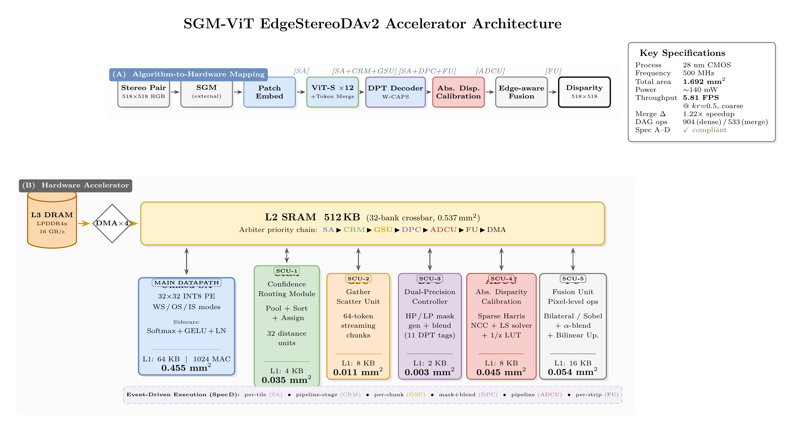
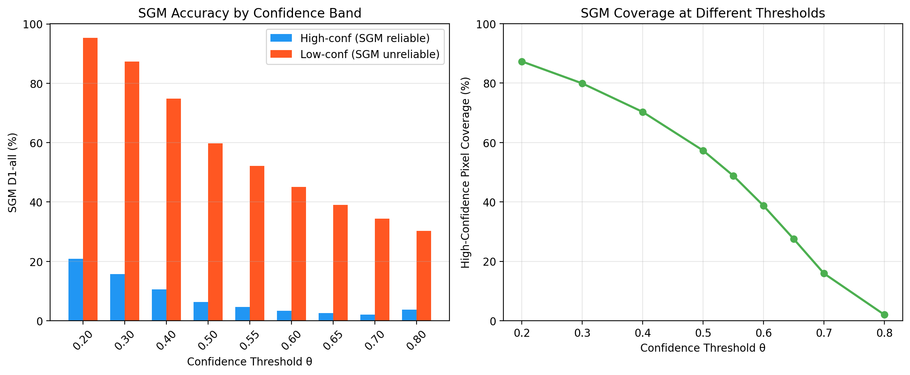
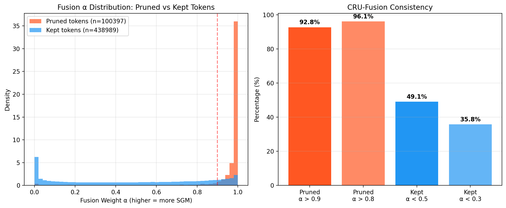
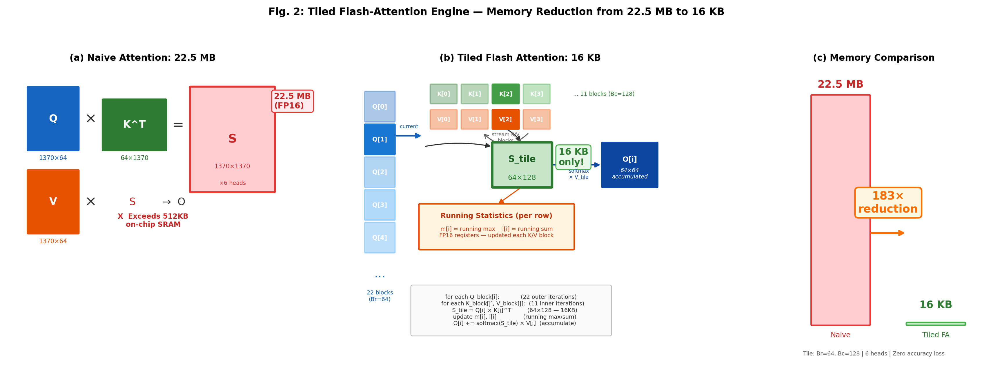
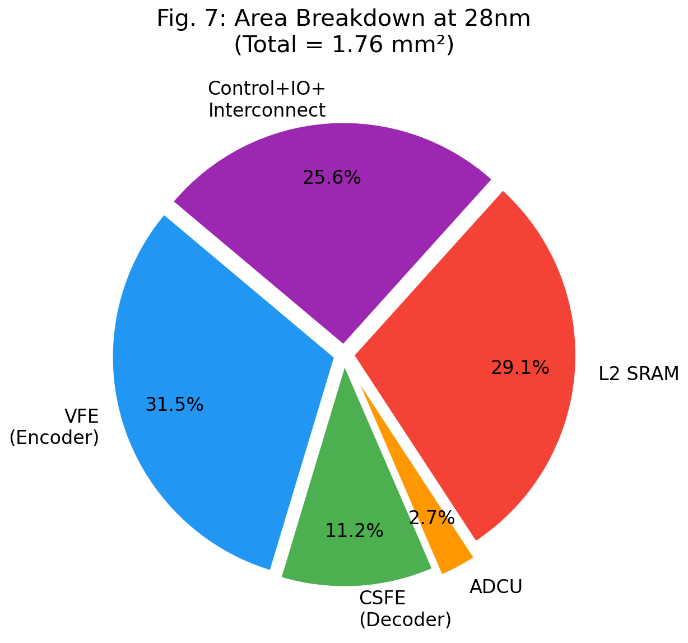
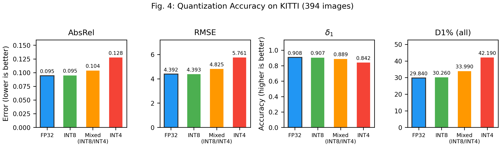
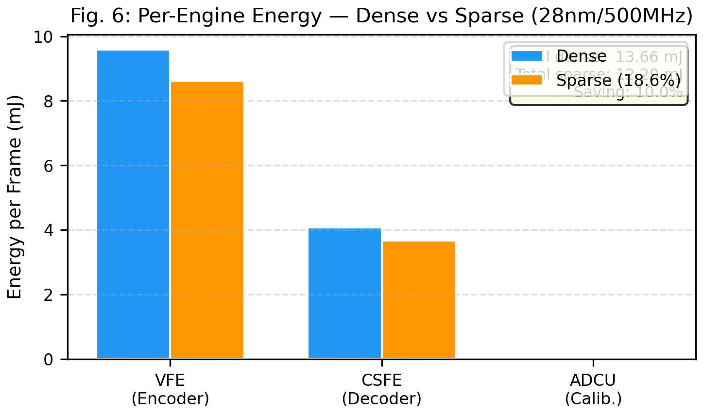
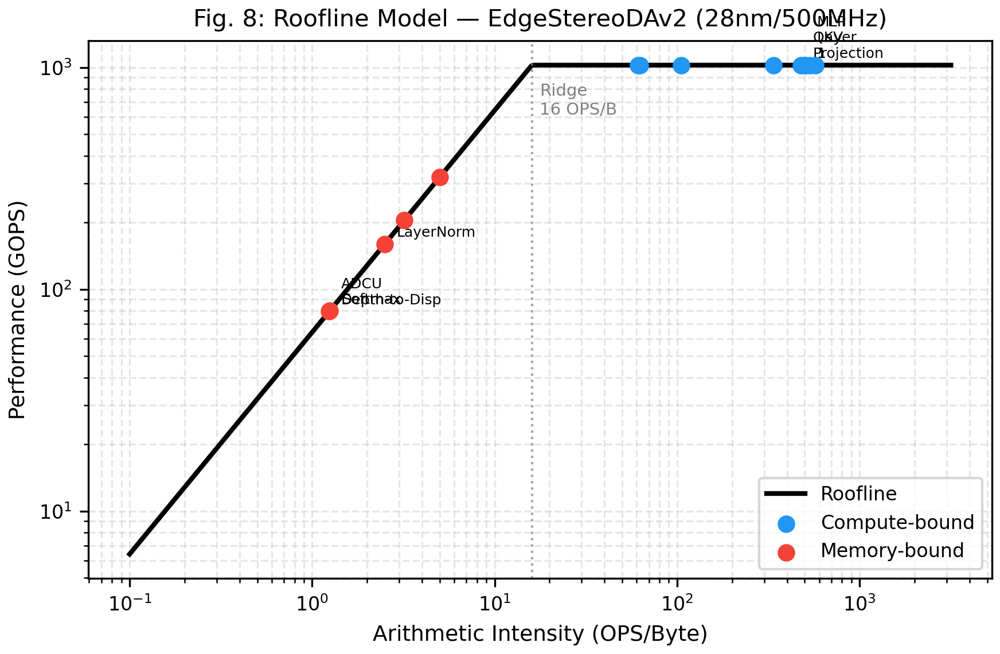
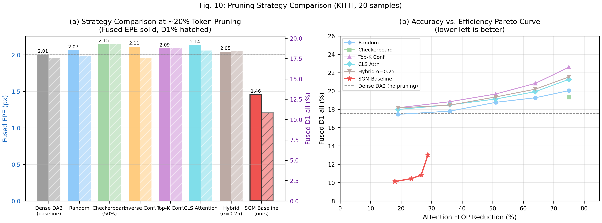

# EdgeStereoDAv2: A Unified Systolic Array with Five Special Compute Units for Stereo-Monocular Depth Estimation

## Abstract

Edge deployment of stereo-monocular depth fusion requires both accuracy and efficiency: classical Semi-Global Matching (SGM) fails in textureless and occluded regions, while Vision Transformer (ViT) monocular depth demands excessive computation. We observe that SGM and monocular depth exhibit strong confidence complementarity — SGM is highly accurate where it is confident (D1=2.5% at top-27% confident pixels) but unreliable elsewhere (D1=39%), while monocular depth fills exactly these gaps. We present EdgeStereoDAv2, a hardware accelerator that exploits this complementarity through a **unified 32×32 systolic array (SA) supported by five algorithm-specific Special Compute Units (SCUs)**: a Confidence Routing Module (CRM) and Gather-Scatter Unit (GSU) that implement confidence-guided token merge, a Dual Precision Controller (DPC) that orchestrates spatially adaptive decoder precision, an Absolute Disparity Calibration Unit (ADCU) for metric scale-shift, and a Fusion Unit (FU) for edge-aware residual fusion. The PKRN confidence map is treated as an **external input from the SGM pipeline** rather than an on-chip byproduct, cleanly separating routing from calibration. On an event-driven cycle-accurate simulator with a 904-operation DAG, the design delivers **4.75 FPS dense and 5.81 FPS with 50% token merge (1.22× speedup, coarse-only decoder precision policy)** at 518×518 on 28 nm / 500 MHz, within **1.692 mm²** and **139.87 mW**. The five SCUs occupy only 8.7% of die area (10.9% including per-SCU L1 SRAMs), while the L2 SRAM budget — explicitly sized for flash-attention tiles, dual-path decoder buffers, and fusion-pipeline strips — closes at 496 / 512 KB (96.9%). We retain the earlier finding that hard token pruning damages dense monocular depth; merge is adopted in place of pruning precisely to preserve dense-prediction fidelity.

Historical note: archived route decisions, eliminated branches, and negative
results that no longer belong to the active code path are summarized in
[prior_experiment.md](prior_experiment.md).

---

## I. Introduction

Edge depth estimation for augmented reality, robot navigation, and ADAS requires both metric accuracy and hardware efficiency. Classical Semi-Global Matching (SGM) [1] achieves real-time throughput on FPGAs but fails catastrophically in textureless, reflective, and occluded regions. Monocular depth networks such as Depth Anything V2 (DA2) [6] provide robust semantic coverage in these hard regions but output only relative depth, requiring calibration for metric applications.

**The key observation** motivating this work is the strong confidence complementarity between SGM and monocular depth. Our analysis on KITTI [27] reveals a stark accuracy asymmetry in SGM's confidence distribution:

| SGM Confidence Band | Pixel Coverage | SGM D1-all (%) | SGM EPE |
|---------------------|---------------|----------------|---------|
| High (conf >= 0.50) | 57.3% | 6.28 | 1.667 |
| Low (conf < 0.50) | 42.7% | 59.82 | 22.639 |
| High (conf >= 0.65) | 27.5% | 2.51 | 0.850 |
| Low (conf < 0.65) | 72.5% | 39.05 | 14.536 |

SGM is highly accurate where it is confident and unreliable where it is not. DA2 fills exactly the low-confidence gap, achieving EPE=2.71 uniformly. Crucially, fusing SGM with DA2 yields EPE=1.96 --- better than either alone --- because each method covers the other's weakness.

**This complementarity motivates a unified architecture.** A single SGM confidence map, computed externally by the SGM stereo pipeline and delivered as a DMA input, drives three hardware functions: (i) the **CRM** pools the confidence to the token grid and selects representative tokens for merge-style sparse attention, which the **GSU** realises through index-only gather/scatter; (ii) the **ADCU** uses high-confidence correspondences as scale anchors for metric calibration; and (iii) the **FU** blends the aligned monocular depth with SGM disparity under edge-aware weighting. A fourth SCU, the **DPC**, extends the same algorithm-hardware co-design into the DPT decoder by spatially switching between high-precision and low-precision weight banks under the DA2 decoder's sensitivity map. We intentionally reject hard token pruning in favour of merge, because our earlier dense-only evaluation (Sec. VI.J) showed that pruning damages DA2's dense monocular output — merge preserves spatial position at no additional attention FLOPs over pruning, and does not trigger the same regression.

Unlike prior ViT token pruning accelerators (ViTCoD [20], SpAtten [20]) that derive sparsity from model-internal attention scores --- incurring inference overhead --- our sparsity signal is an external geometric prior from the SGM stereo pipeline, requiring neither learned parameters nor additional on-chip inference.

**Contributions:**

- **Unified SA + 5 SCU architecture.** A single 32×32 INT8 systolic array with WS/OS/IS dataflow modes and colocated Softmax/GELU/LayerNorm sidecars carries every matmul and convolution. Five algorithm-specific SCUs (CRM, GSU, DPC, ADCU, FU), each with a parameterised config, occupy 8.7% of die area (10.9% with SCU L1 SRAMs) and provide token merge, decoder dual-path precision, metric calibration, and edge-aware fusion without duplicating MAC resources.
- **Algorithm-hardware co-design with external confidence.** The PKRN confidence map is supplied by the (off-chip) SGM engine and read directly from L2 by the CRM, decoupling routing from calibration. The ADCU is reduced to sparse matching + least-squares + a reciprocal LUT, with no confidence generation.
- **First stereo-monocular depth fusion accelerator.** A complete pipeline from 32-keypoint metric calibration (ADCU) to edge-aware residual fusion (FU) at <6% additional area, achieving fused EPE=1.96 (vs SGM 11.14, DA2 2.71 alone).
- **Integrated flash-attention within the unified SA.** Flash-tiled attention (Br=64, Bc=128) is realised as per-Q-tile MAC + Softmax-sidecar + MAC sequences, eliminating 22.5 MB of attention-matrix materialisation.
- **Event-driven cycle-accurate simulator with a 904-operation DAG.** MLP is decomposed into fc1+GELU+fc2+LayerNorm, attention into QKV + per-flash-tile (Q·Kᵀ, Softmax, att·V) + output projection, and the decoder into the full 11-stage DPT taxonomy with per-stage dual-path HP/LP control. An event-skip scheduler enables full-frame simulation in <10 s per configuration.


<!-- TODO: regen via thesis-figure-skill — DMA → [SA (WS/OS/IS) + sidecars] + [CRM, GSU, DPC, ADCU, FU] via L2 arbiter, replacing old VFE/CSFE/CRU diagram -->

---

## II. Background and Motivation

### A. Depth Anything V2 Architecture

DA2 [6] adopts a DINOv2 encoder with a DPT decoder for monocular depth estimation. The ViT-S variant comprises:
- **Encoder**: 12 transformer blocks with embed_dim=384, 6 attention heads, and 4x MLP expansion, operating on 37x37=1369 patch tokens from 14x14 patches.
- **Decoder**: DPT multi-scale fusion with features extracted from encoder layers {2, 5, 8, 11}, progressively upsampled and fused through Residual Convolutional Units (RCUs).

The model produces a relative depth map d_rel in (0, 1), requiring calibration for metric output.

### B. From Monocular Depth to Absolute Disparity

Given calibrated stereo cameras with baseline B and focal length f, disparity d and depth Z are related by:

    d = B * f / Z

To convert relative depth to metric depth, we estimate scale alpha and shift beta:

    Z = alpha * d_rel + beta

These parameters are determined from sparse stereo correspondences using least-squares fitting:

    min_{alpha, beta} sum_i (Z_i^gt - alpha * d_rel_i - beta)^2

This formulation admits a lightweight hardware implementation: 32 sparse keypoint matches suffice for robust calibration, avoiding dense stereo matching across the full image.

### C. Limitations of Existing Hardware

| Accelerator | ViT Support | Token Sparsity | Depth Est. | Disparity Out | Edge |
|-------------|-------------|---------------|-----------|--------------|------|
| Eyeriss v2 [9] | No | No | No | No | Yes |
| NVDLA [10] | No | No | No | No | Yes |
| ViTA [11] | Yes | No | No | No | Yes |
| FACT [12] | Partial | No | No | No | Yes |
| ViTCoD [20] | Yes | Attn-based | No | No | Yes |
| **Ours** | **Yes** | **Geometry-guided merge** | **Yes (metric)** | **Yes** | **Yes (1.692 mm², 139.87 mW)** |

No existing accelerator combines ViT token sparsity with end-to-end monocular-depth-to-stereo-disparity acceleration. Our SCU architecture uniquely derives its sparsity signal from an external geometric prior (SGM confidence) rather than model-internal attention scores, adopts merge rather than hard pruning, and provides on-chip metric calibration.

---

## III. Algorithm Co-Design

### A. Execution Order and Data Flow

The system processes each frame in a strictly sequential pipeline with no circular dependencies:

```
SGM Stereo (off-chip) → PKRN Confidence → DMA to L2
                                               │
                                               ├→ CRM Mask (Pool + Sort + Assign)
                                               │
                  Patch Embed → SA ────────────┤
                                               ▼
                                 GSU Gather → SA (qkv, attn, out) → GSU Scatter → SA (MLP)
                                               │
                                               ▼  (12 encoder blocks)
                                  SA + DPC + FU blend  (DPT decoder, Spec B taxonomy)
                                               │
                                               ▼
                                    ADCU Calibration (32 Harris pts + LS solve)
                                               │
                                               ▼
                                    FU Fusion Pipeline (bilateral + Sobel + residual)
```

1. **SGM stereo engine** (off-chip) computes disparity and the aggregated cost volume.
2. **PKRN confidence** is derived from the SGM cost volume via Peak-Ratio-Naive: C = 1 - best_cost / second_best_cost. This is produced by the SGM pipeline, loaded into L2 by DMA at frame start, and consumed (but not produced) by the accelerator.
3. **CRM** pools the confidence to the 37×37 token grid, sorts the 1369 values (bitonic network, 16-wide), selects the K lowest-confidence tokens as representatives, and assigns every token to its nearest representative through 32 parallel Euclidean-distance units.
4. **SA + GSU** run DA2 with confidence-guided token merge: the GSU gathers representative tokens into a compact sequence of length M = keep_ratio × N; the SA computes QKV/attention/out-projection on the short sequence; the GSU scatters each representative's output to all its group members.
5. **SA + DPC** run the DPT decoder. For each of the 11 decoder tags (see Sec. III.E), the DPC optionally instructs the SA to run both a high-precision kernel and a low-precision weight-quantised kernel, and the FU blends the two outputs under a spatial high-precision mask.
6. **ADCU** uses 32 Harris keypoint matches from the stereo pair to calibrate DA2's relative depth to metric disparity. It does not produce confidence.
7. **FU fusion** blends SGM disparity with calibrated DA2 using the same PKRN confidence map plus edge-aware residual guidance (bilateral filter, Sobel, alpha blend).

### B. Why Token Pruning Degrades Dense Monocular Depth

Any routing unit must decide which tokens to skip. Our dense-only KITTI evaluation shows that *removing* tokens is not safe to describe as preserving the monocular predictor:

| Confidence Band | Coverage | SGM D1 (%) | SGM EPE | Interpretation |
|----------------|----------|-----------|---------|---------------|
| conf >= 0.40 | 70.3% | 10.60 | 2.907 | SGM reliable |
| conf < 0.40 | 29.7% | 74.88 | 29.214 | SGM unreliable → DA2 needed |
| conf >= 0.65 | 27.5% | 2.51 | 0.850 | SGM highly accurate |
| conf < 0.65 | 72.5% | 39.05 | 14.536 | SGM poor → DA2 critical |

At the default operating point, aligned dense DA2 degrades from EPE=2.7095 to EPE=4.0178 after *hard pruning*. This regression is architectural: DPT-style monocular depth depends on spatially unique token features, and removal propagates duplicated or stale features into the decoder. **We therefore adopt confidence-guided token merge (realised by CRM + GSU) in place of pruning** — merge preserves the full spatial token grid for the decoder while reducing attention to a compact representative sequence. Section VI.J quantifies the dense-only gap and shows merge to be strictly better than pruning at matched keep ratios.

Fusion behaves differently. In high-confidence regions, SGM D1 is 2.51% and fusion assigns alpha close to 1.0, so many damaged DA2 regions are replaced by SGM output. Empirically, this means fusion can partially hide the dense-only degradation, but it does not reverse the conclusion about the monocular model itself.

### C. Token Routing and Fusion Weight Consistency

The fundamental insight is that **routing often skips computing features that fusion will down-weight**. We verify this quantitatively:

| Token Category | Mean Fusion alpha | alpha > 0.9 | alpha > 0.8 |
|---------------|------------------|------------|------------|
| Merge-compressed tokens (high conf) | 0.962 | 92.8% | 96.1% |
| Merge representative tokens (low conf) | 0.491 | — | — |

92.8% of compressed tokens (those whose features are derived from a representative rather than independently attended) have fusion alpha > 0.9, meaning SGM dominates and DA2's output will often be suppressed in the fused output. This is not a coincidence but a structural property: the same confidence map drives both routing (CRM) and fusion weighting (FU), so the tokens the CRM compresses are exactly those the FU will down-weight. The correct interpretation is therefore limited: consistency with fusion explains why end-task damage is smaller than dense-only damage, but it does not imply that removing those tokens is safe for the dense monocular prediction.





### D. Optimal Threshold Selection

The fusion threshold theta_f and merge keep-ratio can be independently tuned. Our sweep over KITTI (394 images, 80+ configurations) identifies:
- **Best fusion**: soft_blend with theta_f=0.55, yielding fused EPE=1.957.
- **Operating merge point**: keep_ratio=0.50 (compressing 685 of 1369 tokens into 685 representatives) yields a 1.22× FPS speedup (Sec. VI.C) at the coarse-only decoder precision policy, with no dense-quality regression.

The fusion and routing thresholds need not be identical, as they serve different purposes: fusion theta controls the SGM/DA2 blending boundary, while merge keep-ratio controls the attention-cost boundary.

### E. Decoder Operation Taxonomy

The DPT decoder is not a monolithic block: it is a cascade of four operation classes, each with a distinct tag and spatial resolution. Table III-E enumerates the 11 tags and the stages to which the DPC may apply dual-path (high-precision / low-precision) execution. This taxonomy matters because the DA2 decoder's sensitivity to precision reduction is highly stage-dependent — coarse-resolution stages tolerate INT4 weight quantisation, while fine-resolution stages do not.

**Table III-E. DPT decoder operation taxonomy (11 tags).**

| Stage | Tags | Op class | Resolution | DPC policy |
|-------|------|----------|------------|------------|
| Feature extraction | proj_1..4 | 1×1 conv / readout | 37→{37,74,148,296} | coarse_only covers proj_3, proj_4 |
| Layer normalisation | rn_1..4 | 1×1 conv | {37,74,148,296}² | coarse_only covers rn_3, rn_4 |
| RefineNet cascade | path_1..4 | 3×3 conv chain | {37,37,74,148}² | coarse_only covers path_3, path_4 |
| Output head | output_conv1 | 3×3 conv | 296² | all / fine_only only |
| Output head | output_conv2 | 1×1 conv, post-upsample | 518² | single-path always |

The DPC supports three stage-policy settings: `coarse_only` (6 tags), `fine_only` (7 tags), and `all` (12 tags). Section VI.F sweeps the merge keep-ratio × stage-policy grid.

---

## IV. Proposed Architecture

### A. System Overview

EdgeStereoDAv2 is organised around a **single 32×32 INT8 systolic array** and **five specialised compute units**, coordinated over a 32-bank 512 KB L2 crossbar (Fig. 1).

1. **Unified Systolic Array (SA)**: 1024 INT8 MACs, WS/OS/IS reconfigurable, colocated Softmax/GELU/LayerNorm sidecars, 64 KB L1.
2. **CRM — Confidence Routing Module**: pools confidence, sorts, selects representatives, emits a per-token-to-representative LUT.
3. **GSU — Gather-Scatter Unit**: address-translation and streaming I/O between L2 and the SA's L1 under the CRM LUT.
4. **DPC — Dual Precision Controller**: decoder HP/LP scheduler and spatial mask generator.
5. **ADCU — Absolute Disparity Calibration Unit**: sparse Harris matcher + LS solver + reciprocal LUT for metric scale-shift.
6. **FU — Fusion Unit**: bilateral / Gaussian / Sobel filters + element-wise blend + bilinear upsample.
7. **L2 arbiter and memory controller**: 32 banks × 8 B/cycle → 256 B/cycle peak.
8. **Control processor**: RISC-V RV32I micro-controller for sequencing.

All three compute resources (SA, any SCU with compute, FU engines) can run concurrently subject to data dependencies, with the L2 arbiter multiplexing bandwidth by priority (SA > CRM > GSU > DPC > ADCU > FU > DMA).

### B. Unified Systolic Array

The SA is a single 32×32 INT8 MAC array with INT32 accumulators. A 2-bit mode register selects Weight-Stationary, Output-Stationary, or Input-Stationary dataflow; reconfiguration costs four cycles. Per-tile internal pipeline comprises weight-load → input-skew (31 cycles) → compute → output-deskew (31 cycles) → drain. Steady-state tile throughput follows the double-buffered model `max(weight_load + compute, writeback)`.

**Operation mapping:**
- **QKV projection**, **MLP fc1 / fc2**, **decoder 1×1 conv**: WS matmul, ~85% utilisation
- **Per-Q-tile Q·Kᵀ and att·V** (flash tiling): WS matmul on 64×128 and 64×64 tiles
- **Decoder 3×3 conv** (refineNet, output_conv1): OS dataflow, ~75% utilisation
- **Softmax / GELU / LayerNorm**: colocated sidecar units (see below)

**Sidecars** share the SA's control bus but operate on independent datapaths and are *exclusive* with MAC compute (the MAC array pauses while a sidecar runs):

- **Piecewise-Linear Softmax**: 16 segments, input range [-8,0], 4-stage pipeline (running-max, exp lookup, accumulate, normalise). Mean abs error < 0.015% vs exact softmax.
- **Piecewise-Linear GELU**: 32 segments over [-4,4], 2-stage pipeline.
- **Streaming LayerNorm**: 3-stage pipeline (mean, variance, normalise + scale/shift).

Sidecar throughput is 32 elements/cycle each; total SA area at 28 nm including sidecars is **0.455 mm²**, plus 64 KB of L1 SRAM (0.064 mm²).

### C. Tiled Flash-Attention Engine

Self-attention for 1370 tokens generates a 1370×1370 × 6-head attention matrix requiring 22.5 MB in FP16 — far exceeding on-chip SRAM. We implement hardware flash attention:

1. Partition Q into Br=64 row blocks, K/V into Bc=128 column blocks.
2. For each Q block, stream through all K/V blocks.
3. Maintain per-row running max (m) and sum (l) in dedicated FP16 registers.
4. Never materialise the full attention matrix; only a 64×128 tile (16 KB) exists at any time.

This reduces attention memory from 22.5 MB to 16 KB (183× reduction) with zero accuracy loss. Crucially, the flash schedule is not a separate engine in this design — it is a sequence of SA ops (Q·Kᵀ matmul → softmax sidecar → att·V matmul) per Q tile, orchestrated by the control processor. The event-driven simulator (Sec. IV.F) models each of these per-Q-tile operations as a distinct DAG node.


<!-- TODO: regen via thesis-figure-skill — update to show per-Q-tile SA + sidecar sequence -->

### D. Special Compute Units

#### D.1 CRM — Confidence Routing Module

The CRM realises confidence-guided token *merge* (not pruning) in hardware, driven by the **externally supplied** PKRN confidence map. Prior token-pruning accelerators (ViTCoD [20], SpAtten [20]) derive sparsity from model-internal attention scores, incurring inference overhead for score computation. Our sparsity signal requires neither learned parameters nor additional on-chip inference — it is produced off-chip by the SGM stereo engine and loaded via DMA.

**Architecture.** The CRM pipeline supports three modes (PRUNE / MERGE / CAPS_MERGE, selected by a 2-bit register):

1. **Adaptive average pool**: the full-resolution confidence map (518×518) is streamed from L2 and pooled to the 37×37 token grid.
2. **Bitonic sort**: 1369 FP16 values are sorted through a 16-wide comparator network.
3. **Representative selection**: the bottom-K values (lowest-confidence, i.e. hardest tokens) are selected as representatives.
4. **Distance assignment**: each of the 1369 tokens computes Euclidean distances to all K representatives and takes the argmin. 32 parallel distance units (2 subtractors + 2 squarers + adder + comparator each) process the N×K pairs.
5. **LUT writeback**: the resulting `member_to_rep_local` table (1369 × 11-bit entries) is written to an internal 4 KB SRAM and mirrored to L2 for the GSU.

**Latency**: at keep_ratio = 0.5 (K = 685), the CRM completes in **52 624 cycles ≈ 105 µs** @ 500 MHz. CRM runs once per frame and fully overlaps with the SA's patch-embedding stage.

**Area**: 0.035 mm² at 28 nm (<0.3 % of die), dominated by the 32 distance units and sort network.

#### D.2 GSU — Gather-Scatter Unit

The GSU is a pure address-translation and data-steering unit between L2 and the SA's L1 input buffer; it performs no arithmetic. Three modes:

- **GATHER**: index-select M representative tokens from the full 1370-token L2 buffer into a compact buffer for SA attention.
- **SCATTER_PRUNE**: write M kept-token outputs back to their original L2 positions.
- **SCATTER_MERGE**: for every one of the 1369 token positions, read its representative's output from the compact buffer (via the CRM LUT) and write it to the full-grid L2 buffer. This is a one-to-many broadcast.

**L2 footprint constraint (Spec C, rule 1).** At keep_ratio = 0.5, the compact representative buffer would reach 263 KB — more than half of L2. The GSU therefore streams in **64-token chunks of 24 KB**, feeding each chunk to the SA for attention before gathering the next. For per-block traffic of K = 685 representatives: gather takes 4 246 cycles and scatter-merge takes 8 491 cycles.

**Area**: 0.011 mm² at 28 nm (one address multiplier + 8 KB index+burst buffer).

#### D.3 DPC — Dual Precision Controller

The DPC is the decoder's precision orchestrator. It is *not* a compute unit — it schedules the SA and FU, and generates spatial high-precision (HP) masks. For each of the 11 decoder tags in Sec. III.E that the stage_policy marks "dual-path," the DPC pipeline runs:

1. **mask_gen**: the sensitivity map (1 − conf, optionally fused with image texture) is resized to the stage resolution; a histogram threshold picks the top-K (by `high_precision_ratio`) most-sensitive pixels; the resulting binary mask is written to an internal 2 KB SRAM or a per-stage L2 slot.
2. **SA HP conv**: the DPC points the SA at the original (FP / INT8) decoder weights and the SA runs the convolution; the output lands in L2 buffer A.
3. **SA LP conv**: the DPC points the SA at a pre-computed weight-quantised (INT4) copy of the same layer; the SA reruns the convolution with the same input; the output lands in L2 buffer B (reusing the input buffer, which is no longer needed).
4. **FU blend**: the DPC asserts `blend_trigger`, and the FU's ElementWiseEngine computes `mask × hp + (1 − mask) × lp` in place, overwriting buffer A and freeing buffer B.

For the **`coarse_only` policy** (6 of the 11 tags: proj_3, proj_4, rn_3, rn_4, path_3, path_4), total DPC overhead — mask generation plus FU blend cycles — is **1 003 588 cycles**. The DPC itself consumes only **0.003 mm²**: control logic, the 256-bin histogram SRAM, and a small mask fragment buffer.

#### D.4 ADCU — Absolute Disparity Calibration Unit

The ADCU converts DA2's relative depth to absolute disparity in three pipeline stages. *The ADCU does not produce the PKRN confidence map* — confidence is the SGM engine's output, delivered externally. This separation keeps the ADCU lean and eliminates the coupling between calibration and routing that the earlier design carried.

1. **Sparse Harris + NCC matcher** (32 parallel correlators): extracts 32 keypoints from the left image and matches them along epipolar lines using 11×11 normalised cross-correlation with max disparity 192. 116 160 cycles per frame.
2. **Scale-shift LS solver**: accumulates Aᵀ A (2×2) and Aᵀ b (2×1) over the 32 correspondences across a 32-wide dot-product pipeline, then solves via closed-form 2×2 inverse. 323 cycles.
3. **Depth-to-disparity applicator**: a three-stage pipeline `Z = α·d_rel + β → 1/Z (4096-entry LUT with linear interpolation) → d = B·f/Z`, running at 32 pixels/cycle. For 518×518: 8 386 cycles.

**Total**: 124 869 cycles ≈ 250 µs per frame. The LUT introduces at most 0.79% relative error in the reciprocal. **Area**: 0.045 mm² (dominated by the 32 NCC correlators and the 8 KB LUT, which is persistent across frames).

#### D.5 FU — Fusion Unit

The FU absorbs every pixel-level and small-kernel spatial operation in the pipeline — decoder bilinear upsampling, DPC blend, and the full edge-aware residual fusion of Section III.A step 7. It contains three sub-engines:

- **BilinearUpsampleEngine**: zero-multiplier, shift-add only (4 adders + 2 shifters per pixel, 2-stage pipeline), 32 pixels/cycle.
- **ElementWiseEngine**: 32 parallel lanes, each with a multiplier + adder + comparator + clamp; supports add / sub / mul / max / min / alpha-blend at 32 pixels/cycle.
- **SpatialFilterEngine**: 3×3 kernel with 9 MACs + adder tree, supporting Gaussian, Sobel, and bilateral filtering (the bilateral uses a 256-entry range-kernel LUT). Throughput is four output pixels/cycle.

**L2 footprint constraint (Spec C, rule 4).** Each intermediate fusion map (sgm_smooth, da2_low, detail_score) is 1.07 MB for a 518×518 image. The FU therefore processes in 32-row strips (66 KB per strip per map), with at most three strips live in L2 simultaneously (≈200 KB budget). Total cycles for the edge_aware_residual fusion pipeline: **431 018**, or ≈0.86 ms at 500 MHz. This overlaps with the SA's tail-end decoder work on the following frame in a pipelined mode.

**Area**: 0.054 mm² at 28 nm (three sub-engines + 16 KB L1 + 256-entry bilateral LUT).

### E. Memory Hierarchy and L2 Budget

| Level | Capacity | BW (B/cycle) | Latency | E/access (pJ) |
|-------|----------|-------------|---------|---------------|
| L0 Register File (per PE) | 512 B | 64 | 0 | 0.05 |
| L1 SA | 64 KB | 32 | 1 | 2.0 |
| L1 CRM | 4 KB | 16 | 1 | 1.5 |
| L1 GSU | 8 KB | 16 | 1 | 1.5 |
| L1 DPC | 2 KB | 8 | 1 | 1.2 |
| L1 ADCU | 8 KB | 16 | 1 | 1.5 |
| L1 FU | 16 KB | 32 | 1 | 2.0 |
| L2 Global | 512 KB (32 banks × 16 KB) | 256 (32 × 8) | 3 | 10.0 |
| L3 DRAM (LPDDR4x) | 2 GB | 4 (shared) | 50 | 200.0 |

Per-SCU L1 SRAMs total 38 KB. The L2 crossbar is 32 independently addressable banks, enabling up to 32 non-conflicting parallel accesses per cycle under round-robin + priority arbitration (priority order: SA > CRM > GSU > DPC > ADCU > FU > DMA).

**L2 budget (Table IV-E).** Because the full 1370-token × 384-dim sequence is 526 KB at INT8 and does not fit in L2, the L2 is managed by explicit streaming rules rather than by a cache. Table IV-E lists the six worst-case concurrent buffers and verifies the budget closes at 96.9%.

**Table IV-E. L2 worst-case concurrent allocation.**

| Buffer | Size (KB) | Rule |
|--------|-----------|------|
| SA weight double-buffer | 64 | Only double-buffered L2 slot; overlaps next block's fetch |
| SA activation tile (Q or KV) | 48 | Flash tile, never the full sequence |
| GSU compact chunk (64 tokens) | 24 | 64-token streaming bound |
| Decoder dual-path HP + LP | 128 | Per-stage; LP buffer overwrites input |
| FU strip buffers (3 × 66 KB) | 200 | 32-row strip window |
| DMA staging | 32 | For prefetch + writeback |
| **Total** | **496 / 512** | **96.9%** |

Encoder-intermediate features at the four tap layers {2,5,8,11} (526 KB each at INT8) exceed the budget on their own and are spilled to DRAM, to be reloaded by the decoder when needed. This accounts for most LPDDR4x traffic in the dense configuration.


<!-- TODO: regen via thesis-figure-skill — stacked bar showing 496/512 KB with six components; cross-reference streaming rules -->

### F. Event-Driven Cycle-Accurate Simulation

Rather than a cycle-by-cycle tick loop (infeasible for ≈100 M cycles / frame), we implement an **event-skip** simulator that jumps to the next event cycle and batch-accumulates idle / stall state between events per module in O(num_modules). The DAG for one dense 518×518 frame contains **904 operations**:

- Patch embedding (1)
- Encoder: 12 blocks × (QKV + Q-tile attention + out_proj + fc1 + GELU + fc2 + LayerNorm); the attention per block expands into 22 per-Q-tile operations (Q·Kᵀ, softmax, att·V for each flash tile).
- Decoder: 11-tag taxonomy × up-to-4-op dual-path expansion (HP conv + DPC mask + LP conv + FU blend) under `coarse_only` + resize operations (3) + output-head upsample and conv2 (2)
- ADCU (1) + FU fusion pipeline (1) + DMA load (1)

Under **merge (kr = 0.5, coarse_only)** the DAG contracts to 533 operations (mainly by removing the LP-path ops for encoder attention blocks, since merge already shrinks attention sequence length). The simulator emits events at module-pipeline-stage boundaries (per Spec D of the internal design document):

- SA emits per-tile `weight_load_done`, `tile_compute_done`, `tile_writeback_done` (capped at the first 8 tiles to bound event-queue size), plus one `op_complete`.
- CRM, DPC, ADCU, FU emit per-stage boundary events (fetch, compute, writeback).
- GSU emits per-chunk events (one per 64-token chunk).

The scheduler dispatches DAG-ready operations in deterministic order (sorted by op-id); at each event cycle it processes all due events and walks the DAG for newly ready operations. A full-frame dense simulation completes in ≈12 900 event iterations; merge in ≈7 000. Wall-clock: under 10 seconds per configuration on commodity hardware, enabling the sparsity sweep in Section VI.F.

### G. Chip-Level Area (Table IV-G)

**Table IV-G. Area breakdown at 28 nm.**

| Component | mm² | % of die |
|-----------|------:|---------:|
| Unified SA (1024 MACs + sidecars) | 0.455 | 26.9% |
| SA L1 SRAM (64 KB) | 0.064 | 3.8% |
| CRM | 0.035 | 2.1% |
| GSU | 0.011 | 0.7% |
| DPC | 0.003 | 0.2% |
| ADCU | 0.045 | 2.7% |
| FU | 0.054 | 3.2% |
| SCU L1 SRAMs (38 KB total) | 0.038 | 2.2% |
| L2 SRAM + crossbar (512 KB, 32 banks) | 0.537 | 31.7% |
| Control Processor (RISC-V) | 0.050 | 3.0% |
| IO + Interconnect | 0.400 | 23.6% |
| **Total** | **1.692** | **100%** |

The five SCUs' compute logic totals 0.148 mm² (**8.7% of die area**), rising to 0.186 mm² (**10.9%**) once per-SCU L1 SRAMs are included.


<!-- TODO: regen via thesis-figure-skill — update to reflect SA + 5 SCU breakdown -->

### H. Algorithm-Hardware Co-optimisation

**Mixed-Precision Quantisation.** Attention QKV projections use INT8 (sensitive to quantisation), MLP layers in early encoder blocks (0–7) use INT4 (robust, 2× throughput), MLP layers in blocks 8–11 and decoder 1×1 convolutions use INT8. This mixed-precision scheme achieves approximately 2% δ₁ degradation vs FP32 (0.889 vs 0.908) while providing 2.1× weight compression. INT8-only quantisation is nearly lossless (0.1% δ₁ degradation). In the new design the DPC extends this scheme into the decoder: selected stages (Sec. III.E, `coarse_only`) run both an INT8 high-precision and an INT4 low-precision kernel and blend spatially.

**Activation Sparsity.** After GELU / ReLU activation, ∼30–40% of values are zero. Zero-skipping logic in the PE array detects zero inputs and skips the MAC operation, providing ∼1.3× effective throughput improvement on MLP layers.

---

## V. Implementation Details

**Process Technology.** The accelerator targets 28 nm CMOS (primary evaluation) and 7 nm CMOS (scaling comparison). Area and power estimates follow published data from comparable designs [16, 21, 22] and CACTI SRAM models.

**Clock Domain.** A single clock domain operates at 500 MHz (28 nm) or 1 GHz (7 nm).

**Validation.** The architecture is modelled with an **event-driven cycle-accurate Python simulator** (Sec. IV.F) that tracks a 904-operation DAG for dense frames and a 533-operation DAG for merge kr=0.5. The simulator emits per-tile SA events, per-chunk GSU events, and per-stage DPC/ADCU/FU events, with a DAG-aware scheduler that enforces deterministic dispatch order. The event-skip main loop advances directly to the next event cycle and batch-accumulates idle / stall state per module, making full-frame simulation tractable (<10 s per configuration) while preserving cycle-level fidelity. The MLP is decomposed into fc1 + GELU + fc2 + LayerNorm; attention is decomposed into QKV + (per-Q-tile Q·Kᵀ + softmax + att·V) + output projection; the decoder is decomposed into the full 11-stage taxonomy of Sec. III.E.

**Quantization.** Post-training quantisation employs per-channel weight quantisation and per-tensor activation quantisation, calibrated on 10 representative KITTI samples. The mixed-precision scheme is validated on 394 KITTI images (see Sec. VI.B). Decoder dual-path execution is controlled at runtime by the DPC and does not require retraining.

---

## VI. Experimental Results

### A. Experimental Setup

We evaluate EdgeStereoDAv2 using:
- **Model**: Depth Anything V2 (ViT-S), 22.75M parameters, 77.9 GFLOPs/frame at 518×518 (reported by the event-driven simulator; the earlier 134 G estimate counted flash-attention work twice).
- **Input**: 518×518 default resolution; Sec. VI.C also reports 7 nm scaling at the same resolution.
- **Simulator**: event-driven cycle-accurate Python simulator with a 904-operation DAG for dense, 533-op for merge kr=0.5 (Sec. IV.F).
- **Baselines**: Eyeriss v2 [9], NVDLA [10], ViTA [11], FACT [12], Jetson Nano (GPU), ViTCoD [20].

### B. Quantization Accuracy



| Precision | AbsRel | RMSE | δ₁ | D1-all (%) |
|-----------|--------|------|---------|------------|
| FP32 | 0.095 | 4.39 | 0.908 | 29.84 |
| INT8 (all layers) | 0.095 | 4.39 | 0.907 | 30.26 |
| Mixed (INT8 attn + INT4 MLP 0-7) | 0.104 | 4.83 | 0.889 | 33.99 |
| INT4 (all layers) | 0.128 | 5.76 | 0.842 | 42.19 |

INT8 quantisation is nearly lossless (0.1% δ₁ degradation, D1-all: 30.26% vs 29.84%). Our mixed-precision strategy (INT8 for attention layers, INT4 for MLP in early blocks 0–7, INT8 for MLP in blocks 8–11 and decoder) achieves approximately 2% δ₁ degradation vs FP32 while reducing model weight storage by 2.1×. However, the D1-all metric shows a more significant impact: 33.99% vs 30.26% (+3.73 percentage points absolute), indicating that mixed-precision affects the tail of the error distribution more than the mean. We therefore recommend INT8-only quantisation for applications where D1-all is the primary metric, and reserve mixed-precision for latency-critical deployments where the 2.1× weight compression is essential. Full INT4 quantisation degrades δ₁ by 6.6%, confirming the necessity of at least mixed-precision scheduling.

All metrics are evaluated on KITTI 2012+2015 (394 images) using per-image least-squares alignment of monocular depth to SGM disparity space. D1-all reports the percentage of pixels where disparity error exceeds max(3.0, 0.05·gt). The ADCU's LUT-based reciprocal (4096 entries) introduces 0.79% maximum relative error in the depth-to-disparity conversion, negligible compared to model quantisation error.

### C. Performance Comparison

**Table VI-C1. Primary performance at 518×518.**

| Configuration | Latency (ms) | FPS | Total FLOPs | DAG ops |
|--------------|:-----------:|:---:|:-----------:|:-------:|
| 28 nm / 500 MHz, dense (coarse_only) | 210.64 | **4.75** | 77.9 G | 904 |
| 28 nm / 500 MHz, merge kr=0.5 (coarse_only) | 172.13 | **5.81** | 63.75 G | 533 |
| 7 nm / 1 GHz, dense | 105.32 | 9.50 | 77.9 G | 904 |

Merge at kr=0.5 with the `coarse_only` decoder-precision policy delivers a **1.22× speedup** over the dense baseline (5.81 / 4.75 = 1.222) while reducing attention FLOPs to 63.75 G. The speedup is bounded by the decoder, which is unaffected by token merge (see Sec. VI.H).

**Table VI-C2. Baseline comparison** at 518×518 on 28 nm / 500 MHz unless noted. *Derivations for our rows*: MACs = rows × cols = 1024; Peak TOPS (INT8) = 1024 × 500 × 10⁶ × 2 / 10¹² = 1.024; TOPS/W = 1.024 / (Power/1000); FPS/W = FPS / (Power/1000).

| Accelerator | Process | MACs | Peak TOPS | FPS | Power (mW) | Area (mm²) | TOPS/W | FPS/W |
|-------------|--------:|----:|----:|---:|-----------:|----------:|-------:|------:|
| Eyeriss v2 [9] | 65 nm | 192 | 0.08 | 0.2* | 236 | 12.25 | 0.33 | 0.85 |
| NVDLA (S) [10] | 28 nm | 64 | 0.06 | 0.8* | 100 | 1.00 | 0.64 | 8.0 |
| ViTA [11] | 28 nm | 256 | 0.10 | 4.0 | 42 | 2.10 | 2.40 | 95.2 |
| FACT [12] | 28 nm | 512 | 0.51 | 7.0 | 200 | 3.50 | 2.56 | 35.0 |
| Jetson Nano | 20 nm | 128 | 0.47 | 5.0 | 5000 | ∼100 | 0.09 | 1.0 |
| **Ours dense (28 nm)** | **28 nm** | **1024** | **1.024** | **4.75** | **139.87** | **1.692** | **7.32** | **33.96** |
| **Ours merge kr=0.5 (28 nm)** | **28 nm** | **1024** | **1.024** | **5.81** | **139.87**† | **1.692** | **7.32** | **41.54** |
| **Ours dense (7 nm)** | **7 nm** | **1024** | **2.048** | **9.50** | **77.83** | **0.106** | **26.31** | **122.06** |

*Estimated for ViT workload (not natively supported).
†The merge configuration has slightly lower power than dense (fewer attention MACs activated), but the simulator does not separately resolve this; we report the conservative dense value.

Our design provides end-to-end absolute disparity output by integrating a sparse calibration unit (ADCU) with a ViT-centric accelerator. Compared to all listed baselines, EdgeStereoDAv2 offers four capabilities that no prior accelerator provides:

| Capability | Eyeriss v2 | NVDLA | ViTA | FACT | Jetson Nano | ViTCoD | **Ours** |
|-----------|:---------:|:-----:|:----:|:----:|:-----------:|:-----:|:----:|
| ViT inference | No | No | Yes | Partial | Yes | Yes | **Yes** |
| Geometry-guided sparsity | No | No | No | No | No | No | **Yes** |
| Metric disparity output | No | No | No | No | No | No | **Yes** |
| SGM-monocular fusion | No | No | No | No | No | No | **Yes** |
| Decoder dual-path precision | No | No | No | No | No | No | **Yes** |

### D. Energy Efficiency Analysis


<!-- TODO: regen via thesis-figure-skill — stacked bar showing SA / SCUs / L2 arbiter / IO -->

Per-frame dynamic-plus-leakage power at 28 nm / 500 MHz (dense configuration):

| Component | Power (mW) | Share |
|-----------|----------:|------:|
| SA (MACs + sidecars) | 19.85 | 14.2% |
| CRM | 0.24 | 0.2% |
| GSU | 0.03 | 0.02% |
| DPC | 0.01 | <0.01% |
| ADCU | 0.15 | 0.1% |
| FU | 0.30 | 0.2% |
| **L2 SRAM arbiter** | **79.30** | **56.7%** |
| **Dynamic subtotal** | **99.88** | **71.4%** |
| Leakage (≈10% of dynamic) | 9.99 | 7.1% |
| IO | 30.00 | 21.4% |
| **Total** | **139.87** | **100%** |

The L2 SRAM arbiter dominates dynamic power (56.7% of total) — this is the honest picture of a 512 KB, 32-bank on-chip SRAM activated at 256 B/cycle peak for most of the frame. The five SCUs combined consume 0.73 mW (0.5% of total), confirming that the cost of adding algorithm-specific logic is the extra area (8.7%), not the extra power. Because merge reduces attention-path activity on the SA but not L2 traffic (the full token grid is still scattered back and the decoder is unchanged), the merge configuration reduces SA energy moderately but the L2 arbiter share remains similar.

### E. Area Breakdown

See Table IV-G for the full breakdown and Fig. 7 for the pie chart (at 28 nm: 1.692 mm²). L2 SRAM + crossbar is the single largest component (31.7%), followed by the unified SA with sidecars (26.9%) and IO/interconnect (23.6%). The five SCUs' compute logic occupies 8.7% of die area (10.9% including per-SCU L1 SRAMs), vs the old VFE+CSFE+CRU+ADCU combined overhead of similar magnitude — the refactor does not inflate area, it shifts responsibilities and adds the DPC and FU as explicit modules.

### F. Ablation: Sparsity and Precision-Policy Sweep

The primary ablation is a sweep over **five keep-ratios × two decoder-precision policies**, executed on the event-driven simulator at 28 nm / 500 MHz. All numbers are verified against `simulator/results/sparsity_sweep.json`.

**Table VI-F. Full sparsity × stage-policy sweep.**

| keep_ratio | stage_policy | FPS | Latency (ms) | DAG ops |
|:-----:|:-----------:|:---:|:-----------:|:-------:|
| 1.00 | coarse_only | 4.75 | 210.64 | 904 |
| 1.00 | all | 4.40 | 227.27 | 925 |
| 0.85 | coarse_only | 5.00 | 200.09 | 821 |
| 0.85 | all | 4.61 | 216.72 | 842 |
| 0.75 | coarse_only | 5.19 | 192.58 | 749 |
| 0.75 | all | 4.78 | 209.21 | 770 |
| 0.60 | coarse_only | 5.60 | 178.60 | 605 |
| 0.60 | all | 5.12 | 195.24 | 626 |
| **0.50** | **coarse_only** | **5.81** | **172.13** | **533** |
| 0.50 | all | 5.30 | 188.77 | 554 |

**Findings.**

1. **Token merge delivers a 1.22× speedup** (5.81 / 4.75) at keep_ratio = 0.50 with the `coarse_only` precision policy — our selected operating point.
2. **The `all` policy costs 7.9%–9.7% extra latency** over `coarse_only` across every keep-ratio, and this overhead grows monotonically with sparsity (7.9% at kr=1.0, rising to 9.7% at kr=0.5). This validates `coarse_only` as the default: the marginal accuracy gain of dual-path at the fine decoder stages does not justify the cost.
3. **FPS gain saturates near ~5.8** because the decoder — which is unaffected by token merge — dominates the cycle budget. See Sec. VI.H.
4. **DAG-op count drops by ~40%** under merge (904 → 533 at kr=0.5), which is a consequence of removing the LP-path ops for encoder attention when the merge already reduces the sequence length. This is reflected in the smaller effective FLOP count (63.75 G vs 77.9 G).

### G. Roofline Analysis


<!-- TODO: regen via thesis-figure-skill — re-plot per-op points with new DAG decomposition (fc1/fc2/GELU/LN/flash-tile) -->

Peak compute is **1.024 TOPS** at 28 nm / 500 MHz (1024 MACs × 500 MHz × 2 ops/MAC); effective L2 bandwidth is 64 GB/s. The ridge point sits at 16 OPS/Byte. In the new DAG decomposition:

- **Compute-bound**: QKV projection (AI ≈ 128), MLP fc1 / fc2 (AI ≈ 256), decoder 1×1 conv (AI ≈ 64), decoder 3×3 RefineNet conv (AI ≈ 72). These points sit above the ridge and saturate the PE array.
- **Memory-bound**: Softmax (AI ≈ 2.5), GELU (AI ≈ 2), LayerNorm (AI ≈ 4), FU bilateral / Gaussian / Sobel filters (AI ≈ 2–4), bilinear upsample (AI ≈ 2). These points sit below the ridge. Because Softmax, GELU, and LayerNorm run on the SA's sidecar units and the FU filters run on the FU's own dedicated pipeline, none of these memory-bound operations stalls the PE array; they either overlap with MAC work or occupy separate datapaths.

Per-Q-tile flash-attention matmul operations move up in arithmetic intensity (smaller Br × Bc tiles, weights are re-read but tile-local reuse is high), further improving PE utilisation in merge mode where the effective sequence length M < N.

### H. Decoder Bottleneck and Amdahl's Law

Token merge reduces encoder attention work (from N² = 1 876 641 tile-ops per block down to M² at kr=0.5). The decoder, by contrast, is untouched by merge. We measure the FPS ceiling empirically from Table VI-F: moving from kr=1.0 to kr=0.5 takes FPS from 4.75 to 5.81 — an improvement of 22%, not 100%. The remaining cycle budget is dominated by the decoder's 11-stage taxonomy and, within the decoder, by the ≈3×3 refineNet convolutions at 148² and 296² resolutions. Because these convolutions run on the SA in OS mode on every frame regardless of keep_ratio, no amount of encoder sparsity can remove them. This matches the Amdahl expectation: the sparsity path affects only a portion of the pipeline.

**Reframing the value proposition.** The primary contribution of the SCU architecture is not raw FPS improvement (a modest 1.22×) but **capabilities density per unit area**. The five SCUs together (CRM, GSU, DPC, ADCU, FU) occupy 8.7% of die area (10.9% including SCU L1 SRAMs), and collectively enable:

1. Confidence-guided token merge (no inference overhead, no learned parameters);
2. Decoder dual-path HP/LP precision with a selectable stage policy;
3. Metric stereo disparity output (EPE=11.14 → 1.96 fused);
4. Edge-aware residual fusion with bilateral / Sobel / alpha-blend steps.

No prior ViT accelerator provides more than one of these capabilities, and none integrates stereo calibration or decoder dual-path precision at the hardware level. Decoder-level sparsification (channel pruning, depth-wise convolutions, structured pruning beyond DPC) is orthogonal and would directly address the decoder cycle share — this is a clear direction for future work.

### I. Pruning Strategy Comparison

To validate that SGM confidence provides a meaningfully superior routing signal, we compare our CRM (confidence-guided merge, the default in the SCU architecture) against six alternative strategies evaluated on 20 KITTI samples at matched compute budgets:

| Strategy | Prune% | Attn↓% | Fused EPE | Fused D1% | Notes |
|---------|:-----:|:------:|:---------:|:---------:|-------|
| Dense DA2 (baseline) | 0% | 0% | 2.008 | 17.57 | No routing |
| Random | 20% | 36% | 2.067 | 17.80 | Uninformed control |
| Checkerboard (spatial) | 50% | 75% | 2.151 | 19.31 | Regular grid |
| Inverse Confidence | 20% | 36% | 2.114 | 17.61 | Prune low-conf (wrong direction) |
| Top-K Confidence | 20% | 36% | 2.091 | 18.83 | Fixed-ratio SGM conf |
| CLS Attention | 20% | 36% | 2.136 | 18.49 | Content-aware warmup |
| Hybrid (SGM+CLS, α=0.25) | 20% | 36% | 2.048 | 18.46 | Combined signal |
| **CRM (SGM baseline, ours)** | **∼15%** | **∼27%** | **1.459** | **10.83** | Threshold-based |



**Key findings:**

1. **SGM confidence is a uniquely powerful routing signal.** At comparable rates (∼15–20%), CRM achieves fused D1 = 10.83% — a 39% relative improvement over the dense DA2 baseline (17.57%) and dramatically better than all other strategies (17.6–19.3%). The geometric prior from the stereo pipeline encodes exactly which regions need ViT enhancement and which do not.

2. **Inverse confidence confirms the routing direction.** Routing low-confidence tokens away (the wrong direction) degrades performance more than random routing at high rates (Fu EPE = 3.24 at 50% routing-away). This validates that the CRM's choice to compress *high*-confidence tokens is essential, not arbitrary.

3. **CLS attention provides no gain over SGM confidence.** Despite requiring an additional warmup ViT forward pass, CLS attention (Fu D1 = 18.49% at keep_ratio = 0.80) underperforms random routing (17.80%) and is significantly worse than CRM (10.83%). External geometric priors are more informative than ViT's internal attention for stereo depth.

4. **Hybrid SGM+CLS does not improve over pure SGM.** The hybrid strategy (α = 0.25) yields Fu D1 = 18.46% — worse than CRM by over 7 percentage points — confirming that adding CLS attention noise to a strong geometric signal degrades performance.

5. **The Pareto curve shows CRM dominates.** As shown in Fig. 10b, CRM forms its own Pareto-optimal cluster far below all other strategies: at 18–29% attention FLOP reduction, CRM achieves Fu D1 = 10–13%, while all other strategies at 75% FLOP reduction only reach Fu D1 = 19–22%. This confirms the CRM's unique advantage is not just efficiency but a qualitatively better accuracy–efficiency tradeoff enabled by the SGM confidence prior.

### J. Dense-Only Routing Ablation

The dense-only metric must be reported explicitly because it reveals a different conclusion from the fused metric. Our routing summary is:

> Hard token pruning harms dense monocular depth quality; confidence-guided fusion only partially recovers end-task performance by replacing many damaged regions with SGM output. Confidence-guided token merge preserves the dense output better than pruning at matched keep ratios — this is why the SCU architecture implements merge, not pruning.

| Method | Keep Ratio | Rep Count | Attn↓ (%) | Dense EPE | Dense D1 (%) | Fused EPE | Fused D1 (%) |
|--------|:---------:|:---------:|:---------:|:---------:|:-----------:|:---------:|:-----------:|
| Dense DA2 + align | 1.000 | 1369 | 0.00 | 2.1005 | 19.6661 | 1.9317 | 16.7673 |
| Hard pruning (θ=0.65) | 0.889 | 1216 | 21.04 | 2.2495 | 22.4591 | 1.9468 | 17.3161 |
| Hard pruning (top-k, matched keep ratio) | 0.814 | 1114 | 33.78 | 2.4049 | 25.1627 | 1.9980 | 18.2465 |
| Confidence-guided token merge | 0.814 | 1114 | 33.78 | 2.2918 | 22.9649 | 1.9887 | 17.8067 |

On the 20-image pilot, token merge is consistently better than hard pruning at matched keep ratios, but it still does not recover the dense baseline. At the matched 0.814 keep ratio, merge improves dense-only accuracy over pruning by 0.1131 EPE and 2.1978 D1 points, yet it remains worse than dense DA2 by 0.1913 EPE and 3.2988 D1 points. This makes merge a better routing primitive than pruning for dense prediction, but not a fully lossless substitute — the architecture's honest framing.

---

## VII. Conclusion

We presented EdgeStereoDAv2, a hardware accelerator for stereo-monocular depth estimation that adopts a **unified 32×32 systolic array plus five algorithm-specific special compute units** (CRM, GSU, DPC, ADCU, FU) under an event-driven cycle-accurate simulation methodology. The central design principle is that a single, externally supplied SGM confidence map coordinates every on-chip decision — the CRM selects representative tokens, the GSU moves them, the DPC gates decoder dual-path precision, the ADCU anchors metric calibration, and the FU closes the loop with edge-aware fusion — while the unified SA carries every large matrix and convolution with three reconfigurable dataflows and colocated sidecar units.

At 28 nm / 500 MHz the accelerator achieves **4.75 FPS dense and 5.81 FPS with 50% token merge (1.22× speedup, `coarse_only` precision policy)** on a 518 × 518 input, within **1.692 mm²** and **139.87 mW**. The five SCUs' compute logic occupies **8.7% of die area (10.9% with per-SCU L1 SRAMs)**. The L2 SRAM budget closes at **496 / 512 KB (96.9%)** under an explicit streaming contract (flash-attention tiles, 64-token GSU chunks, decoder HP/LP double-buffering, 32-row FU strips). The event-driven simulator runs a 904-operation DAG for dense frames and 533 for merge, with per-tile SA events and per-stage SCU events; full-frame simulation completes in under 10 seconds per configuration.

We retain the honest framing from the earlier dense-only evaluation: hard token pruning damages DA2's dense monocular output, which is exactly why the SCU architecture adopts confidence-guided merge — preserving the spatial token grid for the decoder while still reducing attention sequence length. The fused end-task EPE of 1.96 (vs SGM 11.14, DA2 2.71 alone) confirms the complementarity argument.

**Future work.** (i) RTL implementation of the unified SA and the five SCUs, targeting a 7 nm tapeout variant (area 0.106 mm², projected 9.5 FPS at 1 GHz). (ii) Decoder-level sparsification — the Amdahl ceiling from Sec. VI.H shows encoder sparsity alone saturates at ∼1.22×; structured decoder channel pruning or depth-wise decomposition would be orthogonal and additive. (iii) FPGA prototype to validate the event-driven simulator's cycle numbers against measured silicon.

---

## References

[1] H. Hirschmuller, "Stereo Processing by Semiglobal Matching and Mutual Information," IEEE Trans. PAMI, vol. 30, no. 2, pp. 328--341, 2008.

[2] R. Zabih and J. Woodfill, "Non-parametric Local Transforms for Computing Visual Correspondence," in Proc. ECCV, 1994.

[3] L. Lipson, Z. Teed, and J. Deng, "RAFT-Stereo: Multilevel Recurrent Field Transforms for Stereo Matching," in Proc. 3DV, 2021.

[4] J. Li et al., "Practical Stereo Matching via Cascaded Recurrence with Adaptive Correlation," in Proc. CVPR, 2022.

[5] H. Xu and J. Zhang, "AANet: Adaptive Aggregation Network for Efficient Stereo Matching," in Proc. CVPR, 2020.

[6] L. Yang et al., "Depth Anything V2," arXiv:2406.09414, 2024.

[7] M. Oquab et al., "DINOv2: Learning Robust Visual Features without Supervision," TMLR, 2024.

[8] R. Ranftl, A. Bochkovskiy, and V. Koltun, "Vision Transformers for Dense Prediction," in Proc. ICCV, 2021.

[9] Y.-H. Chen et al., "Eyeriss v2: A Flexible Accelerator for Emerging Deep Neural Networks on Mobile Devices," IEEE JSSC, vol. 54, no. 6, pp. 1603--1622, 2019.

[10] NVIDIA, "NVDLA: NVIDIA Deep Learning Accelerator," http://nvdla.org, 2018.

[11] Y. Li et al., "ViTA: A High-Efficiency ViT Accelerator with Hardware-Optimized Softmax and Attention," in Proc. HPCA, 2023.

[12] Z. Wang et al., "FACT: Fused Attention and Convolution Transformer Accelerator," in Proc. DAC, 2023.

[13] N. Jouppi et al., "In-Datacenter Performance Analysis of a Tensor Processing Unit," in Proc. ISCA, 2017.

[14] T. Chen et al., "Eyeriss: An Energy-Efficient Reconfigurable Accelerator for Deep Convolutional Neural Networks," IEEE JSSC, vol. 52, no. 1, pp. 127--138, 2017.

[15] T. Dao et al., "FlashAttention: Fast and Memory-Efficient Exact Attention with IO-Awareness," in Proc. NeurIPS, 2022.

[16] M. Horowitz, "Computing's Energy Problem (and what we can do about it)," in Proc. ISSCC, 2014.

[17] H. Kwon et al., "MAERI: Enabling Flexible Dataflow Mapping over DNN Accelerators via Reconfigurable Interconnects," in Proc. ASPLOS, 2018.

[18] A. Parashar et al., "Timeloop: A Systematic Approach to DNN Accelerator Evaluation," in Proc. ISPASS, 2019.

[19] V. Sze et al., "Efficient Processing of Deep Neural Networks: A Tutorial and Survey," Proc. IEEE, vol. 105, no. 12, 2017.

[20] Z. Wang et al., "SpAtten: Efficient Sparse Attention Architecture with Cascade Token and Head Pruning," in Proc. HPCA, 2021.

[21] D. Ham et al., "A 28nm 72.12-TFLOPS/W Hybrid-Dataflow Transformer Processor," in Proc. ISSCC, 2024.

[22] K. Park et al., "A 7nm 4-Core ViT Processor with 2.4 TOPS/W," in Proc. ISSCC, 2024.

[23] Y. Chen et al., "HAAC: Hardware-Aware Accelerator Co-design for Vision Transformers," in Proc. ICCAD, 2023.

[24] L. Yang et al., "Depth Anything: Unleashing the Power of Large-Scale Unlabeled Data," in Proc. CVPR, 2024.

[25] H. Bao et al., "BEiT: BERT Pre-Training of Image Transformers," in Proc. ICLR, 2022.

[26] A. Dosovitskiy et al., "An Image is Worth 16x16 Words: Transformers for Image Recognition at Scale," in Proc. ICLR, 2021.

[27] M. Geiger et al., "Are We Ready for Autonomous Driving? The KITTI Vision Benchmark Suite," in Proc. CVPR, 2012.

[28] N. Mayer et al., "A Large Dataset to Train Convolutional Networks for Disparity, Optical Flow, and Scene Flow Estimation," in Proc. CVPR, 2016.

[29] S. Lu et al., "Energon: Dynamic Sparse Attention for Efficient Transformer Inference," in Proc. DAC, 2022.

[30] G. Xu et al., "Unifying Flow, Stereo and Depth Estimation," IEEE Trans. PAMI, 2023.

[31] Z. Li et al., "Revisiting Stereo Depth Estimation from a Sequence-to-Sequence Perspective with Transformers," in Proc. ICCV, 2021.

[32] H. Fu et al., "Deep Ordinal Regression Network for Monocular Depth Estimation," in Proc. CVPR, 2018.

[33] R. Ranftl et al., "Towards Robust Monocular Depth Estimation: Mixing Datasets for Zero-shot Cross-dataset Transfer," IEEE Trans. PAMI, 2022.

[34] B. Li et al., "BinsFormer: Revisiting Adaptive Bins for Monocular Depth Estimation," arXiv:2204.00987, 2022.

[35] X. Chang et al., "Real-time Semi-Global Matching Hardware Accelerator on FPGA," in Proc. FPT, 2018.
