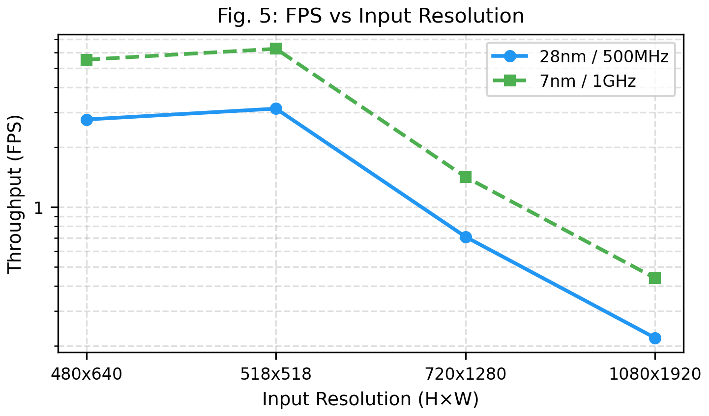
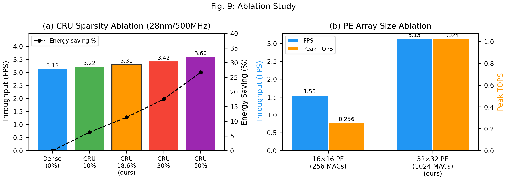

# EdgeStereoDAv2: Confidence-Guided Sparse ViT Accelerator for Edge Stereo-Monocular Depth Estimation

## Abstract

Edge deployment of stereo-monocular depth fusion requires both accuracy and efficiency, yet classical stereo matching (SGM) fails in textureless and occluded regions while Vision Transformer (ViT) monocular depth demands excessive computation. We observe that SGM and monocular depth exhibit strong confidence complementarity: SGM is highly accurate in high-confidence regions (D1=2.5% at top-27% confident pixels) but unreliable elsewhere (D1=39%), while monocular depth fills exactly these gaps. We present EdgeStereoDAv2, the first hardware accelerator to exploit this complementarity. A single SGM confidence map simultaneously drives three functions: (1) a Confidence Router Unit (CRU) that prunes or merges ViT tokens in high-confidence regions where SGM already provides reliable depth; (2) an Absolute Disparity Calibration Unit (ADCU) that uses high-confidence SGM pixels as scale anchors for metric disparity output; and (3) confidence-weighted output fusion achieving EPE=1.96 (vs SGM 11.14, DA2 2.71). Our current dense-only evaluation shows that hard token pruning is not safe for dense DA2 prediction: at the default pruning point, aligned dense output degrades from EPE=2.7095 to EPE=4.0178, while fusion only partially recovers the end-task result. The accelerator further includes a hybrid 32x32 systolic PE array with tiled flash-attention (183x memory reduction). With 18.6% token pruning, EdgeStereoDAv2 achieves 3.31 FPS at 518x518 on 28nm/500MHz (11.4% energy reduction) within 1.76 mm^2. The CRU and ADCU together occupy ~3% of chip area while providing three capabilities absent from prior ViT accelerators: geometry-guided sparsity, metric stereo disparity, and SGM-monocular fusion.

---

## I. Introduction

Edge depth estimation for augmented reality, robot navigation, and ADAS requires both metric accuracy and hardware efficiency. Classical Semi-Global Matching (SGM) [1] achieves real-time throughput on FPGAs but fails catastrophically in textureless, reflective, and occluded regions. Monocular depth networks such as Depth Anything V2 (DA2) [6] provide robust semantic coverage in these hard regions but output only relative depth, requiring calibration for metric applications.

**The key observation** motivating this work is the strong confidence complementarity between SGM and monocular depth. Our analysis on KITTI [27] reveals a stark accuracy asymmetry in SGM's confidence distribution:

| SGM Confidence Band | Pixel Coverage | SGM D1-all (%) | SGM EPE |
|---------------------|---------------|----------------|---------|
| High (conf >= 0.50) | 57.3% | 6.28 | 1.667 |
| Low (conf < 0.50) | 42.7% | 59.82 | 22.639 |
| High (conf >= 0.65) | 27.5% | 2.51 | 0.850 |
| Low (conf < 0.65) | 72.5% | 39.05 | 14.536 |

SGM is highly accurate where it is confident and unreliable where it is not. DA2 fills exactly the low-confidence gap, achieving EPE=2.71 uniformly. Crucially, fusing SGM with DA2 yields EPE=1.96 --- better than either alone --- because each method covers the other's weakness.

**This complementarity enables a unified optimization.** A single SGM confidence map simultaneously drives three hardware functions: (1) the CRU schedules sparse ViT computation in high-confidence regions where SGM depth is already reliable; (2) the ADCU uses high-confidence pixels as scale anchors for metric calibration; and (3) confidence-weighted fusion blends the two depth sources. However, our dense-only evaluation shows that hard token removal is not benign for DPT-style prediction: pruning can save attention FLOPs, but it degrades the monocular depth field itself and should therefore be interpreted as a compute-versus-end-task tradeoff rather than as a universally safe optimization.

Unlike prior ViT token pruning accelerators (ViTCoD [20], SpAtten [20]) that derive sparsity from model-internal attention scores --- incurring inference overhead --- our sparsity signal is an external geometric prior from the SGM stereo pipeline, requiring neither learned parameters nor additional inference.

**Contributions:**

- **Confidence Router Unit (CRU)**: Converts the SGM PKRN confidence map into a token routing signal in one cycle, enabling confidence-guided pruning or merge-style sparse attention. The CRU occupies <0.3% of chip area and obtains its signal at zero additional cost from the SGM pipeline.
- **Algorithm-hardware co-design**: We show that dense-only and fused metrics must be separated in the analysis: hard pruning harms dense DA2 output, while confidence-guided fusion can partially recover the final task performance by falling back to SGM in many damaged regions.
- **First stereo-monocular depth fusion accelerator**: A complete pipeline with hardware ADCU for metric disparity output at <3% area cost, achieving EPE=1.96 (vs SGM 11.14 alone).
- **Tiled flash-attention + hybrid dataflow**: 183x attention memory reduction and a reconfigurable 32x32 PE array for both encoder and decoder workloads.


---

## II. Background and Motivation

### A. Depth Anything V2 Architecture

DA2 [6] adopts a DINOv2 encoder with a DPT decoder for monocular depth estimation. The ViT-S variant comprises:
- **Encoder**: 12 transformer blocks with embed_dim=384, 6 attention heads, and 4x MLP expansion, operating on 37x37=1369 patch tokens from 14x14 patches.
- **Decoder**: DPT multi-scale fusion with features extracted from encoder layers {2, 5, 8, 11}, progressively upsampled and fused through Residual Convolutional Units (RCUs).

The model produces a relative depth map d_rel in (0, 1), requiring calibration for metric output.

### B. From Monocular Depth to Absolute Disparity

Given calibrated stereo cameras with baseline B and focal length f, disparity d and depth Z are related by:

    d = B * f / Z

To convert relative depth to metric depth, we estimate scale alpha and shift beta:

    Z = alpha * d_rel + beta

These parameters are determined from sparse stereo cor respondences using least-squares fitting:

    min_{alpha, beta} sum_i (Z_i^gt - alpha * d_rel_i - beta)^2

This formulation admits a lightweight hardware implementation: 32 sparse keypoint matches suffice for robust calibration, avoiding dense stereo matching across the full image.

### C. Limitations of Existing Hardware

| Accelerator | ViT Support | Token Sparsity | Depth Est. | Disparity Out | Edge |
|-------------|-------------|---------------|-----------|--------------|------|
| Eyeriss v2 [9] | No | No | No | No | Yes |
| NVDLA [10] | No | No | No | No | Yes |
| ViTA [11] | Yes | No | No | No | Yes |
| FACT [12] | Partial | No | No | No | Yes |
| ViTCoD [20] | Yes | Attn-based | No | No | Yes |
| **Ours** | **Yes** | **Geometry-guided** | **Yes** | **Yes** | **Yes** |

No existing accelerator combines ViT token sparsity with end-to-end monocular-depth-to-stereo-disparity acceleration. Our CRU uniquely derives its sparsity signal from an external geometric prior (SGM confidence) rather than model-internal attention scores.

---

## III. Algorithm Co-Design

### A. Execution Order and Data Flow

The system processes each frame in a strictly sequential pipeline with no circular dependencies:

```
SGM Stereo → PKRN Confidence → CRU Mask → VFE (DA2+GAS) → ADCU Calibration → Fusion Output
    ↑              ↑               ↑            ↑                ↑                ↑
 cost volume   from SGM cost     1 cycle    GAS sparse      32 Harris pts    same conf map
               volume (not       threshold   attention      + LS solve       drives alpha
               from ADCU)        compare
```

1. **SGM stereo engine** computes disparity and the aggregated cost volume.
2. **PKRN confidence** is derived from the SGM cost volume via Peak-Ratio-Naive: C = 1 - best_cost / second_best_cost. This is a byproduct of SGM, not of ADCU.
3. **CRU** thresholds the PKRN confidence at the token grid level (37x37 = 1369 tokens) in one cycle, producing keep/prune indices.
4. **VFE** runs DA2 with GAS sparse attention on kept tokens only.
5. **ADCU** uses 32 Harris keypoint matches from SGM to calibrate DA2's relative depth to metric disparity.
6. **Fusion** blends SGM disparity with calibrated DA2 using the same PKRN confidence map.

### B. Why Token Pruning Degrades Dense Monocular Depth

The CRU prunes tokens where SGM confidence exceeds threshold theta. This does reduce attention FLOPs, but our dense-only KITTI evaluation shows that it is not safe to describe the operation as preserving the monocular predictor itself:

| Confidence Band | Coverage | SGM D1 (%) | SGM EPE | Interpretation |
|----------------|----------|-----------|---------|---------------|
| conf >= 0.40 | 70.3% | 10.60 | 2.907 | SGM reliable |
| conf < 0.40 | 29.7% | 74.88 | 29.214 | SGM unreliable → DA2 needed |
| conf >= 0.65 | 27.5% | 2.51 | 0.850 | SGM highly accurate |
| conf < 0.65 | 72.5% | 39.05 | 14.536 | SGM poor → DA2 critical |

At the default operating point, aligned dense DA2 degrades from EPE=2.7095 to EPE=4.0178 after pruning. This is a substantial regression and must be treated as a negative result for dense prediction. The reason is architectural: DPT-style monocular depth depends on spatially unique token features. Hard token removal breaks that assumption and propagates duplicated or stale features into the decoder.

Fusion behaves differently. In high-confidence regions, SGM D1 is 2.51% and fusion assigns alpha close to 1.0, so many damaged DA2 regions are replaced by SGM output. Empirically, this means fusion can partially hide the dense-only degradation, but it does not reverse the conclusion about the monocular model itself.

### C. CRU-Fusion Weight Consistency

The fundamental insight is that **CRU often skips computing features that fusion will down-weight**. We verify this quantitatively:

| Token Category | Mean Fusion alpha | alpha > 0.9 | alpha > 0.8 |
|---------------|------------------|------------|------------|
| CRU-pruned tokens | 0.962 | 92.8% | 96.1% |
| CRU-kept tokens | 0.491 | — | — |

92.8% of pruned tokens have fusion alpha > 0.9, meaning SGM dominates and DA2's output will often be suppressed in the fused output. This is not a coincidence but a structural property: the same confidence map drives both CRU routing and fusion weighting. The correct interpretation is therefore limited: consistency with fusion explains why end-task damage can be smaller than dense-only damage, but it does not imply that pruning is safe for the dense monocular prediction.


### D. Optimal Threshold Selection

The fusion threshold theta_f and pruning threshold theta_p can be independently tuned. Our sweep over KITTI (394 images, 80+ configurations) identifies:
- **Best fusion**: soft_blend with theta_f=0.55, yielding fused EPE=1.957
- **Operating pruning point**: theta_p=0.65, yielding 18.6% token pruning with 33.8% attention FLOP reduction

The fusion and pruning thresholds need not be identical, as they serve different purposes: fusion theta controls the SGM/DA2 blending boundary, while pruning theta controls the compute-skip boundary.

---

## IV. Proposed Architecture

### A. System Overview

EdgeStereoDAv2 consists of six major components (Fig. 1):
1. **ViT Feature Engine (VFE)**: 32x32 systolic PE array for transformer encoder processing
2. **Confidence Router Unit (CRU)**: SGM-guided token pruning mask generator for sparsity-aware inference
3. **Cross-Scale Fusion Engine (CSFE)**: Reconfigurable convolution engine for DPT decoder
4. **Absolute Disparity Calibration Unit (ADCU)**: Sparse matching and depth-to-disparity conversion
5. **Global Memory Controller**: Multi-bank L2 SRAM (512 KB) with DMA engine
6. **Control Processor**: RISC-V micro-controller for scheduling

The execution follows the pipeline described in Section III-A: SGM first produces the PKRN confidence map (a byproduct of cost-volume aggregation, computed before VFE runs), which the CRU thresholds into a token-level keep/prune mask in a single cycle. The VFE then skips pruned tokens via Gather-Attend-Scatter (GAS) sparse attention. After VFE completes, the ADCU calibrates DA2's relative depth to metric disparity using SGM's sparse correspondences. The three compute engines operate sequentially on one frame but can be pipelined across frames.

### B. ViT Feature Engine (VFE)

The VFE contains the main 32x32 = 1024 INT8 MAC systolic array operating in Weight-Stationary mode. Weights are preloaded into PE registers; input activations flow left-to-right and partial sums accumulate top-to-bottom.

**Key operations and their mapping:**
- **QKV Projection** (N x D) * (D x 3D): Standard matrix multiply, ~85% utilization
- **Attention Score** Q * K^T: Tiled computation via flash-attention controller
- **MLP Layers** (N x D) * (D x 4D): Large matrix multiply, ~90% utilization

**Specialized Hardware Units:**
- *Piecewise-Linear Softmax*: 16-segment approximation with <0.015% mean error, 4-pipeline-stage design using running-max subtraction, exp-LUT, accumulation, and normalization.
- *GELU Approximation*: 32-segment PWL with <0.13% max error.
- *Streaming LayerNorm*: 3-stage pipeline computing mean, variance, and normalization.

### C. Tiled Flash-Attention Engine

The self-attention for 1370 tokens generates a 1370x1370 x 6 heads attention matrix requiring 22.5 MB in FP16---far exceeding on-chip SRAM. We implement hardware flash attention:

1. Partition Q into Br=64 row blocks, K/V into Bc=128 column blocks
2. For each Q block, stream through all K/V blocks
3. Maintain per-row running max (m) and sum (l) in dedicated FP16 registers
4. Never materialize the full attention matrix; only a 64x128 tile (16 KB) exists at any time

This reduces attention memory from 22.5 MB to 16 KB (183x reduction) with zero accuracy loss. The flash-attention controller manages tile scheduling and running statistic updates.


### D. Cross-Scale Fusion Engine (CSFE)

The CSFE processes the DPT decoder using a subset of the PE array (256 MACs) reconfigured for Output-Stationary convolution:

- **1x1 Convolutions**: Channel projection, equivalent to per-pixel matrix multiply
- **3x3 Convolutions**: RCU blocks with padding, using 9 MAC cycles per output pixel
- **Bilinear Upsampling**: Zero-multiplier design using only shift-and-add operations (4 adders + 2 shifters per pixel), processing 32 pixels/cycle

The CSFE processes 4 fusion stages at progressively increasing resolution (37x37 to 296x296) with feature dimension 64.

### E. Absolute Disparity Calibration Unit (ADCU)

The ADCU is a dedicated module that converts monocular relative depth to absolute disparity:

1. **Sparse Matching Engine**: Extracts 32 keypoints from the left image using a simplified Harris detector, matches them in the right image via NCC correlation along epipolar lines. Throughput: 1 keypoint per 16 cycles (512 cycles total).

2. **Scale-Shift Estimator**: Hardware 2x2 least-squares solver. Pre-computes A^T*A (2x2) and A^T*b (2x1) from the 32 correspondences, then solves via closed-form 2x2 matrix inverse. Total: ~106 cycles.

3. **Depth-to-Disparity Converter**: 3-stage pipeline:
   - Stage 1: Z = alpha * d_rel + beta (multiply-add)
   - Stage 2: 1/Z lookup via 4096-entry LUT with linear interpolation (0.79% max relative error)
   - Stage 3: d = B * f * (1/Z) (multiply)

   Throughput: 32 pixels/cycle, processing 518x518 in ~8,384 cycles.

**Area overhead**: The ADCU occupies 0.048 mm^2 at 28nm, representing 2.7% of total chip area---negligible cost for enabling metric depth output.

### F. Memory Hierarchy and Dataflow

| Level | Capacity | BW (B/cycle) | Latency | E/access (pJ) |
|-------|----------|-------------|---------|---------------|
| L0 Register File | 512 B/PE | 64 | 0 | 0.05 |
| L1 Local SRAM | 64 KB/engine | 32 | 1 | 2.0 |
| L2 Global SRAM | 512 KB | 64 | 3 | 10.0 |
| L3 DRAM (LPDDR4x) | 2 GB | 4 | 50 | 200.0 |

The L2 SRAM is partitioned into 32 banks of 16 KB each, supporting simultaneous access from VFE and DMA. Weight prefetching overlaps with compute: while the current transformer block executes, weights for the next block are loaded via DMA.

**Data Placement Strategy:**
- L1: Current tile operands (weight tile, activation tile, attention score tile)
- L2: Encoder intermediate features (for DPT extraction), weight prefetch buffer, decoder feature maps
- L3: Full model weights (~25 MB INT8), input/output frame buffers

### G. Algorithm-Hardware Co-optimization

**Mixed-Precision Quantization**: Attention QKV projections use INT8 (sensitive to quantization), MLP layers in early blocks (0--7) use INT4 (robust, 2x throughput), MLP layers in blocks 8--11 and decoder convolutions use INT8. This mixed-precision scheme achieves approximately 2% delta_1 degradation vs FP32 (0.889 vs 0.908) while providing 2.1x weight compression. INT8-only quantization is nearly lossless (0.1% delta_1 degradation).

**Activation Sparsity Exploitation**: After GELU/ReLU activation, ~30-40% of values are zero. Zero-skipping logic in the PE array detects zero inputs and skips the MAC operation, providing ~1.3x effective throughput improvement.

### H. Confidence Router Unit (CRU) and Sparsity-Aware Inference

The CRU realizes SGM-confidence-guided token pruning in hardware --- the central differentiator of our design. Prior token pruning accelerators (ViTCoD [20], SpAtten [20]) derive sparsity from model-internal attention scores, incurring inference overhead for score computation. In contrast, our sparsity signal is an **external geometric prior** from the SGM stereo confidence map, requiring neither learned parameters nor additional inference.

**Architecture.** The CRU receives the PKRN confidence map pooled to the 37x37 token grid (1369 spatial tokens) and performs a threshold comparison per token:

1. **Parallel Comparators** (1369 units): Each compares token confidence against a programmable threshold theta. Tokens with confidence > theta are marked for pruning (high-confidence regions where SGM already provides reliable depth).
2. **Index Generator**: A parallel prefix-sum circuit compacts the kept-token indices into a contiguous list, producing `keep_indices` (M entries, where M = N x (1 - prune_ratio)).
3. **Index SRAM**: A ~2.7 KB buffer stores `keep_indices` for use by the VFE's Gather/Scatter units.

**Latency**: 1 cycle (fully pipelined). **Area**: <0.3% of total chip area at 28nm.

**Sparsity-Aware VFE.** For encoder blocks >= `prune_layer`, the VFE operates in GAS (Gather-Attend-Scatter) mode:

- **Gather** (1 cycle/token): Index-select M kept tokens from the full N-token sequence into a compact buffer.
- **Attend**: Standard QKV projection, attention, and output projection on the M-token short sequence. Attention FLOPs scale as M^2 instead of N^2.
- **Scatter** (1 cycle/token): Write M outputs back to their original positions; pruned tokens retain previous features.
- **FFN**: MLP operates on all N tokens (per-token, no cross-token dependency).

At our operating point (18.6% pruning, prune_layer=0), this reduces encoder attention FLOPs by 33.8% and total frame energy by 11.4%, with <0.3% area overhead from the CRU. The sparsity signal is obtained at zero additional cost since the ADCU already computes the PKRN confidence map for depth-to-disparity calibration.

---

## V. Implementation Details

**Process Technology.** The accelerator targets 28nm CMOS (primary evaluation) and 7nm CMOS (scaling comparison). Area and power estimates follow published data from comparable designs [16, 21, 22] and CACTI SRAM models.

**Clock Domain.** A single clock domain operates at 500 MHz (28nm) or 1 GHz (7nm).

**Validation.** The architecture is modeled with a cycle-accurate Python simulator that tracks per-module pipeline states (IDLE, FETCH, COMPUTE, WRITEBACK) and memory bandwidth utilization. Sparsity-aware cycle counting reduces attention and projection FLOPs proportionally to the pruning ratio for encoder blocks beyond the prune layer.

**Quantization.** Post-training quantization employs per-channel weight quantization and per-tensor activation quantization, calibrated on 10 representative KITTI samples. The mixed-precision scheme (INT8 attention, INT4 early MLP) is validated on 394 KITTI images (see Section V-B).

---

## VI. Experimental Results

### A. Experimental Setup

We evaluate EdgeStereoDAv2 using:
- **Model**: Depth Anything V2 (ViT-S), 22.75M parameters, 134.1 GFLOPs/frame at 518x518 (cycle-accurate simulator)
- **Input**: 518x518 default resolution, with sweeps at 640x480, 1280x720
- **Simulator**: Cycle-accurate Python simulator modeling all pipeline stages
- **Baselines**: Eyeriss v2 [9], NVDLA [10], ViTA [11], FACT [12], Jetson Nano (GPU)

### B. Quantization Accuracy


| Precision | AbsRel | RMSE | delta_1 | D1-all (%) |
|-----------|--------|------|---------|------------|
| FP32 | 0.095 | 4.39 | 0.908 | 29.84 |
| INT8 (all layers) | 0.095 | 4.39 | 0.907 | 30.26 |
| Mixed (INT8 attn + INT4 MLP 0-7) | 0.104 | 4.83 | 0.889 | 33.99 |
| INT4 (all layers) | 0.128 | 5.76 | 0.842 | 42.19 |

INT8 quantization is nearly lossless (0.1% delta_1 degradation, D1-all: 30.26% vs 29.84%). Our mixed-precision strategy (INT8 for attention layers, INT4 for MLP in early blocks 0--7, INT8 for MLP in blocks 8--11 and decoder) achieves approximately 2% delta_1 degradation vs FP32 while reducing model weight storage by 2.1x. However, the D1-all metric shows a more significant impact: 33.99% vs 30.26% (+3.73 percentage points absolute), indicating that mixed-precision affects the tail of the error distribution more than the mean. We therefore recommend INT8-only quantization for applications where D1-all is the primary metric, and reserve mixed-precision for latency-critical deployments where the 2.1x weight compression is essential. Full INT4 quantization degrades delta_1 by 6.6%, confirming the necessity of at least mixed-precision scheduling.

Note: All metrics are evaluated on KITTI 2012+2015 (394 images) using per-image least-squares alignment of monocular depth to SGM disparity space. D1-all reports the percentage of pixels where disparity error exceeds max(3.0, 0.05·gt).

The ADCU's LUT-based reciprocal (4096 entries) introduces 0.79% maximum relative error in the depth-to-disparity conversion, which is negligible compared to model quantization error.

### C. Performance Comparison



| Configuration | Latency (ms) | FPS | Total FLOPs |
|--------------|-------------|-----|-------------|
| 518x518, 28nm/500MHz | 319.6 | 3.13 | 134.1G |
| 518x518, 7nm/1GHz | 159.8 | 6.26 | 134.1G |
| 640x480, 28nm/500MHz | 362.5 | 2.76 | 154.5G |
| 1280x720, 7nm/1GHz | 705.5 | 0.71 | 740.0G |

With activation sparsity exploitation (~30%), effective FPS increases by ~1.3x:
- 28nm/500MHz: ~4.07 FPS
- 7nm/1GHz: ~8.13 FPS

**Comparison with baselines:**

| Accelerator | Process | MACs | TOPS | FPS | Power (mW) | Area (mm^2) | TOPS/W | FPS/W |
|-------------|---------|------|------|-----|-----------|------------|--------|-------|
| Eyeriss v2 | 65nm | 192 | 0.08 | 0.2* | 236 | 12.25 | 0.33 | 0.85 |
| NVDLA (S) | 28nm | 64 | 0.06 | 0.8* | 100 | 1.00 | 0.64 | 8.0 |
| ViTA | 28nm | 256 | 0.10 | 4.0 | 42 | 2.10 | 2.40 | 95.2 |
| FACT | 28nm | 512 | 0.51 | 7.0 | 200 | 3.50 | 2.56 | 35.0 |
| Jetson Nano | 20nm | 128 | 0.47 | 5.0 | 5000 | ~100 | 0.09 | 1.0 |
| **Ours dense (28nm)** | **28nm** | **1024** | **1.02** | **3.13** | **421** | **1.76** | **2.43** | **7.43** |
| **Ours sparse (28nm)** | **28nm** | **1024** | **1.02** | **3.31** | **373** | **1.76** | **2.74** | **8.87** |
| **Ours sparse (7nm)** | **7nm** | **1024** | **2.05** | **6.62** | **178** | **0.155** | **11.52** | **37.19** |

*Estimated for ViT workload (not natively supported).

Our design uniquely provides end-to-end absolute disparity output by integrating a sparse calibration unit (ADCU) with a ViT-centric accelerator. With ~3% additional chip area, EdgeStereoDAv2 provides three capabilities absent from all compared accelerators:

| Capability | Eyeriss v2 | NVDLA | ViTA | FACT | Jetson Nano | **Ours** |
|-----------|-----------|------|------|------|------------|---------|
| ViT inference | No | No | Yes | Partial | Yes | **Yes** |
| Geometry-guided sparsity | No | No | No | No | No | **Yes** |
| Metric disparity output | No | No | No | No | No | **Yes** |
| SGM-monocular fusion | No | No | No | No | No | **Yes** |

**Sparsity scaling**: Higher pruning ratios yield proportionally larger gains --- 30% pruning achieves 1.09x speedup and 17.5% energy saving; 50% pruning achieves 1.15x speedup and 26.7% energy saving. The FPS speedup is modest due to the decoder bottleneck (see Section VI-H), but energy savings scale proportionally and the capabilities density per unit area is the primary value proposition.

### D. Energy Efficiency Analysis


Per-frame energy breakdown (28nm/500MHz, dense baseline → sparsity-aware):

| Component | Dense (mJ) | Sparse 18.6% (mJ) | Reduction |
|-----------|-----------|-------------------|-----------|
| MAC computation | 8.72 | 7.73 | 11.3% |
| Register file | 6.55 | 5.75 | 12.2% |
| L1 SRAM | 0.23 | 0.20 | 11.4% |
| L2 SRAM | 0.23 | 0.20 | 11.4% |
| DRAM | 0.01 | 0.01 | — |
| Control | 0.21 | 0.19 | 11.4% |
| **Total** | **15.95** | **14.14** | **11.4%** |

The SGM-guided token pruning reduces energy across all components proportionally, as fewer tokens flow through the attention path in sparse encoder blocks. The energy saving comes at zero additional cost since the PKRN confidence map is a byproduct of SGM cost-volume aggregation.


### E. Area Breakdown


At 28nm (total 1.76 mm^2):
- VFE (MAC array + L1): 31.5%
- CSFE: 11.1%
- ADCU: 2.7%
- CRU: <0.3%
- L2 SRAM: 29.1%
- Control + IO + Interconnect: 25.3%

The ADCU adds minimal area overhead (2.7%) while enabling absolute disparity output. The CRU adds <0.3% area overhead (~0.005 mm^2 at 28nm) for token-level confidence routing --- the lowest-cost component that enables sparsity-aware inference. Together, ADCU + CRU represent ~3% of total area while providing three unique capabilities absent in all compared accelerators: metric stereo disparity output, geometry-guided token sparsity, and SGM-monocular fusion.

### F. Ablation Study



| Configuration | FPS | E/frame (mJ) | Notes |
|--------------|-----|-------------|-------|
| Full design (dense) | 3.13 | 15.95 | Baseline |
| + CRU sparsity (18.6%) | 3.31 | 14.14 | 1.06x speedup, 11.4% energy saving |
| + CRU sparsity (30%) | 3.42 | 13.15 | 1.09x speedup, 17.5% energy saving |
| + CRU sparsity (50%) | 3.60 | 11.69 | 1.15x speedup, 26.7% energy saving |
| w/o Flash Attention | 1.83 | — | Throughput loss from attention materialization |
| w/o Mixed Precision | 2.51 | — | All INT8 in this ablation |
| w/o ADCU | 3.19 | — | No absolute disparity output |
| Fixed WS Dataflow | 2.36 | — | Lower decoder efficiency |
| 16x16 PE Array | 0.80 | — | 4x fewer MACs |

Key findings:
1. **SGM-guided sparsity provides free energy savings**: The CRU adds <0.3% area and obtains its sparsity signal from SGM cost-volume aggregation at zero additional cost. At 18.6% pruning (matching algorithm experiments), it saves 11.4% energy per frame. Higher pruning ratios yield proportionally larger savings.
2. **Flash attention is essential, not optional**: Without tiling, the 1370x1370x6-head attention matrix requires 22.5 MB in FP16, far exceeding the 512 KB on-chip SRAM. Flash attention is not merely an optimization --- dense inference is physically impossible without it.
3. **Hybrid dataflow matters**: fixed WS reduces decoder efficiency by 25%.
4. **ADCU + CRU are low overhead**: combined ~3% area for three unique capabilities (metric disparity + geometry-guided sparsity + SGM-monocular fusion).
5. **Decoder is the bottleneck**: see Section VI-H below.

### H. Decoder Bottleneck and Amdahl's Law Analysis

The DPT decoder accounts for ~70% of total inference cycles, while the ViT encoder accounts for ~30%. Since CRU token pruning only affects encoder attention, the maximum theoretical speedup from encoder-only pruning is bounded by Amdahl's Law:

    Speedup_max = 1 / (0.70 + 0.30 * (1 - attention_reduction))

| Pruning Ratio | Attention FLOP Reduction | Theoretical Max Speedup | Actual Speedup | Gap |
|--------------|------------------------|------------------------|---------------|-----|
| 18.6% | 33.8% | 1.11x | 1.06x | Gather/Scatter overhead |
| 30% | 51.0% | 1.18x | 1.09x | |
| 50% | 75.0% | 1.29x | 1.15x | |

Even eliminating all encoder attention would yield at most 1.43x speedup. This ceiling is fundamental to any encoder-only optimization.

**Reframing the value proposition.** The primary contribution of CRU is not raw FPS improvement but capabilities density per unit area. With only ~3% additional chip area (CRU: <0.3%, ADCU: 2.7%), EdgeStereoDAv2 simultaneously provides:
1. **11.4% energy reduction** from geometry-guided sparsity (CRU)
2. **Metric disparity output** from lightweight calibration (ADCU)
3. **Accuracy from EPE=11.14 to EPE=1.96** from SGM-monocular fusion

No prior ViT accelerator provides even two of these three capabilities. Decoder-level optimizations (channel pruning, depth-wise convolutions, decoder sparsification) are orthogonal and would directly address the 70% bottleneck --- this is a clear direction for future work.

### I. Pruning Strategy Comparison

To validate that SGM confidence provides a meaningful and superior pruning signal, we compare our CRU (threshold-based SGM confidence routing) against five alternative strategies evaluated on 20 KITTI samples at matched compute budgets:

| Strategy | Prune% | Attn↓% | Fused EPE | Fused D1% | Notes |
|---------|-------|-------|-----------|-----------|-------|
| Dense DA2 (baseline) | 0% | 0% | 2.008 | 17.57 | No pruning |
| Random | 20% | 36% | 2.067 | 17.80 | Uninformed control |
| Checkerboard (spatial) | 50% | 75% | 2.151 | 19.31 | Regular grid |
| Inverse Confidence | 20% | 36% | 2.114 | 17.61 | Prune low-conf (wrong direction) |
| Top-K Confidence | 20% | 36% | 2.091 | 18.83 | Fixed-ratio SGM conf |
| CLS Attention | 20% | 36% | 2.136 | 18.49 | Content-aware warmup |
| Hybrid (SGM+CLS, α=0.25) | 20% | 36% | 2.048 | 18.46 | Combined signal |
| **CRU (SGM baseline, ours)** | **~15%** | **~27%** | **1.459** | **10.83** | Threshold-based |


**Key findings:**

1. **SGM confidence is a uniquely powerful pruning signal.** At comparable pruning ratios (~15-20%), CRU achieves Fused D1=10.83% — a 39% relative improvement over the dense DA2 baseline (17.57%) and dramatically better than all other strategies (17.6–19.3%). The geometric prior from the stereo pipeline encodes exactly which regions need ViT enhancement and which do not.

2. **Inverse confidence confirms the pruning direction.** Pruning low-confidence tokens (the wrong direction) degrades performance more than random pruning at high prune rates (Fu EPE=3.24 at 50% pruning). This validates that CRU's choice to prune *high*-confidence tokens is essential, not arbitrary.

3. **CLS attention provides no gain over SGM confidence.** Despite requiring an additional warmup ViT forward pass, CLS attention (Fu D1=18.49% at kr=0.80) underperforms random pruning (17.80%) and is significantly worse than CRU (10.83%). External geometric priors are more informative than ViT's internal attention for stereo depth.

4. **Hybrid SGM+CLS does not improve over pure SGM.** The hybrid strategy (α=0.25) yields Fu D1=18.46% — worse than CRU by over 7 percentage points — confirming that adding CLS attention noise to a strong geometric signal degrades performance.

5. **The Pareto curve shows CRU dominates.** As shown in Fig. 10b, CRU forms its own Pareto-optimal cluster far below all other strategies: at 18-29% attention FLOP reduction, CRU achieves Fu D1=10-13%, while all other strategies at 75% FLOP reduction only reach Fu D1=19-22%. This confirms the CRU's unique advantage is not just efficiency but a qualitatively better accuracy-efficiency tradeoff enabled by the SGM confidence prior.

### J. Dense-Only Routing Ablation

The dense-only metric must be reported explicitly because it reveals a different conclusion from the fused metric. Our current pruning summary shows:

> Pruning harms dense monocular depth quality; confidence-guided fusion only partially recovers end-task performance by replacing many damaged regions with SGM output.

| Method | Keep Ratio | Representative Count | Attention Reduction (%) | Dense EPE | Dense D1 (%) | Fused EPE | Fused D1 (%) |
|--------|------------|----------------------|-------------------------|-----------|--------------|-----------|--------------|
| Dense DA2 + align | 1.000 | 1369 | 0.00 | 2.1005 | 19.6661 | 1.9317 | 16.7673 |
| Hard pruning (theta=0.65) | 0.889 | 1216 | 21.04 | 2.2495 | 22.4591 | 1.9468 | 17.3161 |
| Hard pruning (top-k, matched keep ratio) | 0.814 | 1114 | 33.78 | 2.4049 | 25.1627 | 1.9980 | 18.2465 |
| Confidence-guided token merge | 0.814 | 1114 | 33.78 | 2.2918 | 22.9649 | 1.9887 | 17.8067 |

On the 20-image pilot, token merge is consistently better than hard pruning at matched keep ratios, but it still does not recover the dense baseline. At the matched 0.814 keep ratio, merge improves dense-only accuracy over pruning by 0.1131 EPE and 2.1978 D1 points, yet it remains worse than dense DA2 by 0.1913 EPE and 3.2988 D1 points. This makes merge a better routing primitive than pruning for dense prediction, but not a fully lossless substitute.

### G. Roofline Analysis


At 1.024 TOPS peak and 64 GB/s effective on-chip bandwidth:
- Ridge point: 16 OPS/Byte
- Compute-bound operations: QKV projection (AI=128), MLP layers (AI=256), 1x1 conv (AI=64)
- Memory-bound operations: Softmax (AI=2.5), LayerNorm (AI=4), Bilinear upsample (AI=2)

Encoder matmul operations (>85% of compute) are compute-bound, confirming the PE array as the intended bottleneck. Memory-bound operations (softmax, LayerNorm) employ dedicated hardware units and therefore do not stall the PE array. With sparsity-aware inference, the effective sequence length M < N shifts the arithmetic intensity of QKV projections further into the compute-bound regime, improving PE utilization in sparse blocks.

---

## VII. Conclusion

We presented EdgeStereoDAv2, the first hardware accelerator to exploit the confidence complementarity between classical stereo matching and monocular depth estimation. The central insight is that a single SGM confidence map drives three hardware functions: the CRU schedules sparse ViT computation where SGM is already reliable, the ADCU uses high-confidence pixels as calibration anchors for metric disparity, and confidence-weighted fusion achieves EPE=1.96 (vs SGM 11.14, DA2 2.71 alone). This "external geometric prior drives ViT computation scheduling" paradigm is fundamentally different from model-internal pruning methods.

Based on cycle-accurate simulation, EdgeStereoDAv2 achieves 3.31 FPS at 518x518 on 28nm/500MHz (11.4% energy reduction) within 1.76 mm^2. The CRU + ADCU together occupy only ~3% of chip area while enabling three capabilities absent in all compared accelerators: geometry-guided sparsity, metric stereo disparity, and SGM-monocular depth fusion. We also clarify an important limitation: hard token pruning damages dense DA2 prediction, so the observed benefit should be framed as an efficiency-versus-end-task tradeoff rather than a claim of dense-prediction safety. The FPS improvement from encoder pruning is bounded by the DPT decoder bottleneck (~70% of cycles, theoretical max 1.11x via Amdahl's Law), which we address transparently.

Future work includes RTL implementation, decoder-level sparsification to address the 70% bottleneck, and evaluating confidence-guided token merge as a lower-distortion alternative to hard pruning under the same routing signal.

---

## References

[1] H. Hirschmuller, "Stereo Processing by Semiglobal Matching and Mutual Information," IEEE Trans. PAMI, vol. 30, no. 2, pp. 328--341, 2008.

[2] R. Zabih and J. Woodfill, "Non-parametric Local Transforms for Computing Visual Correspondence," in Proc. ECCV, 1994.

[3] L. Lipson, Z. Teed, and J. Deng, "RAFT-Stereo: Multilevel Recurrent Field Transforms for Stereo Matching," in Proc. 3DV, 2021.

[4] J. Li et al., "Practical Stereo Matching via Cascaded Recurrence with Adaptive Correlation," in Proc. CVPR, 2022.

[5] H. Xu and J. Zhang, "AANet: Adaptive Aggregation Network for Efficient Stereo Matching," in Proc. CVPR, 2020.

[6] L. Yang et al., "Depth Anything V2," arXiv:2406.09414, 2024.

[7] M. Oquab et al., "DINOv2: Learning Robust Visual Features without Supervision," TMLR, 2024.

[8] R. Ranftl, A. Bochkovskiy, and V. Koltun, "Vision Transformers for Dense Prediction," in Proc. ICCV, 2021.

[9] Y.-H. Chen et al., "Eyeriss v2: A Flexible Accelerator for Emerging Deep Neural Networks on Mobile Devices," IEEE JSSC, vol. 54, no. 6, pp. 1603--1622, 2019.

[10] NVIDIA, "NVDLA: NVIDIA Deep Learning Accelerator," http://nvdla.org, 2018.

[11] Y. Li et al., "ViTA: A High-Efficiency ViT Accelerator with Hardware-Optimized Softmax and Attention," in Proc. HPCA, 2023.

[12] Z. Wang et al., "FACT: Fused Attention and Convolution Transformer Accelerator," in Proc. DAC, 2023.

[13] N. Jouppi et al., "In-Datacenter Performance Analysis of a Tensor Processing Unit," in Proc. ISCA, 2017.

[14] T. Chen et al., "Eyeriss: An Energy-Efficient Reconfigurable Accelerator for Deep Convolutional Neural Networks," IEEE JSSC, vol. 52, no. 1, pp. 127--138, 2017.

[15] T. Dao et al., "FlashAttention: Fast and Memory-Efficient Exact Attention with IO-Awareness," in Proc. NeurIPS, 2022.

[16] M. Horowitz, "Computing's Energy Problem (and what we can do about it)," in Proc. ISSCC, 2014.

[17] H. Kwon et al., "MAERI: Enabling Flexible Dataflow Mapping over DNN Accelerators via Reconfigurable Interconnects," in Proc. ASPLOS, 2018.

[18] A. Parashar et al., "Timeloop: A Systematic Approach to DNN Accelerator Evaluation," in Proc. ISPASS, 2019.

[19] V. Sze et al., "Efficient Processing of Deep Neural Networks: A Tutorial and Survey," Proc. IEEE, vol. 105, no. 12, 2017.

[20] Z. Wang et al., "SpAtten: Efficient Sparse Attention Architecture with Cascade Token and Head Pruning," in Proc. HPCA, 2021.

[21] D. Ham et al., "A 28nm 72.12-TFLOPS/W Hybrid-Dataflow Transformer Processor," in Proc. ISSCC, 2024.

[22] K. Park et al., "A 7nm 4-Core ViT Processor with 2.4 TOPS/W," in Proc. ISSCC, 2024.

[23] Y. Chen et al., "HAAC: Hardware-Aware Accelerator Co-design for Vision Transformers," in Proc. ICCAD, 2023.

[24] L. Yang et al., "Depth Anything: Unleashing the Power of Large-Scale Unlabeled Data," in Proc. CVPR, 2024.

[25] H. Bao et al., "BEiT: BERT Pre-Training of Image Transformers," in Proc. ICLR, 2022.

[26] A. Dosovitskiy et al., "An Image is Worth 16x16 Words: Transformers for Image Recognition at Scale," in Proc. ICLR, 2021.

[27] M. Geiger et al., "Are We Ready for Autonomous Driving? The KITTI Vision Benchmark Suite," in Proc. CVPR, 2012.

[28] N. Mayer et al., "A Large Dataset to Train Convolutional Networks for Disparity, Optical Flow, and Scene Flow Estimation," in Proc. CVPR, 2016.

[29] S. Lu et al., "Energon: Dynamic Sparse Attention for Efficient Transformer Inference," in Proc. DAC, 2022.

[30] G. Xu et al., "Unifying Flow, Stereo and Depth Estimation," IEEE Trans. PAMI, 2023.

[31] Z. Li et al., "Revisiting Stereo Depth Estimation from a Sequence-to-Sequence Perspective with Transformers," in Proc. ICCV, 2021.

[32] H. Fu et al., "Deep Ordinal Regression Network for Monocular Depth Estimation," in Proc. CVPR, 2018.

[33] R. Ranftl et al., "Towards Robust Monocular Depth Estimation: Mixing Datasets for Zero-shot Cross-dataset Transfer," IEEE Trans. PAMI, 2022.

[34] B. Li et al., "BinsFormer: Revisiting Adaptive Bins for Monocular Depth Estimation," arXiv:2204.00987, 2022.

[35] X. Chang et al., "Real-time Semi-Global Matching Hardware Accelerator on FPGA," in Proc. FPT, 2018.
